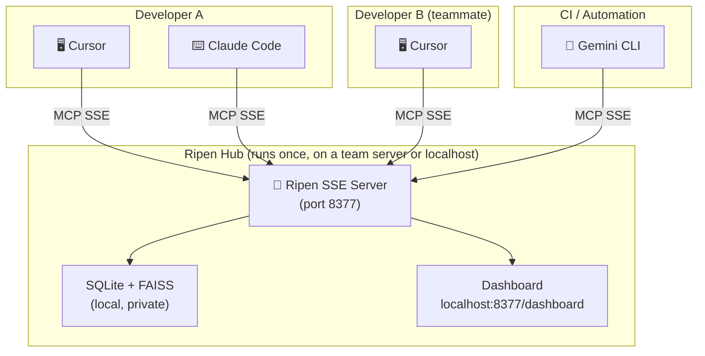

# Ripen: The "Trust Layer" for Multi-Agent AI Teams 🧠

**Centralized Knowledge Hub for AI-Driven Development. One server. Every tool. Every teammate.**

[](https://pypi.org/project/ripen/)
[](LICENSE)
[](CHANGELOG.md)

> 🇯🇵 **ローカルホストのSSEサーバーを起動するだけで、チームの全AIエージェントが同じ知識を共有できる。Ripenは「AI駆動開発チームの共有記憶インフラ」です。**

---

## What Makes Ripen Different

Most MCP memory servers run in `stdio` mode — a 1:1 connection between **one IDE and one server**. Knowledge stays siloed.

**Ripen runs as an SSE Hub** — an HTTP server that accepts **N:1 connections**. Multiple agents, multiple IDEs, multiple teammates, all reading and writing to the same shared brain simultaneously.

```
[Typical MCP Memory]          [Ripen Hub Mode]

Cursor ──── memory-A          Cursor ──┐
                              Claude ──┼──▶ Ripen Hub ◀── shared knowledge
Claude ──── memory-B          Gemini ──┘    (one source of truth)
                              Teammate's Cursor ──┘
```

This is the **core innovation**: automated cross-agent, cross-user knowledge sharing via a local SSE server.

---

## Quick Start

### Hub Setup (Run once per project/team)

```bash
# Start the shared knowledge hub
uvx ripen --sse

# In a new terminal: interactive setup wizard
uvx ripen-init
# > Select mode: hub
# Guides you through LLM config, data directory, and IDE registration
# At the end, displays your Client Connection URL for teammates
```

### Client Setup (Every teammate runs this)

```bash
# No Python required. Just register your IDE to the hub.
uvx ripen-init
# > Select mode: client
# > Hub URL: http://192.168.1.10:8377
# Done. All your IDEs now share the team's memory.
```

Or with a single command:
```bash
uvx ripen-register --hub-url http://192.168.1.10:8377
```

---

## The Problem: AI "Multi-Personality Disorder"

AI-driven development made your team 10x faster, but your knowledge is now scattered:

- **Isolated Context**: Cursor knows your coding conventions — but **Claude Code doesn't**.
- **Memory Decay**: Gemini CLI resolved a bug yesterday — but **Cursor forgot it by today**.
- **Architectural Drift**: Your team decided on a pattern — but **every AI tool proposes a different one**.
- **Cross-User Silos**: Developer A's AI made a key decision — but **Developer B's AI has no idea**.

The faster you ship, the faster your AI tools **diverge**. Ripen stops this drift with a **Single Source of Truth (SSoT)** shared by every agent on your team.

---

## Architecture: Hub & Clients



**One Hub. N Clients. Zero manual sync.**

---

## Key Features

### 1. Hybrid Intelligence Store
- **Logic Graph**: Stores entities and relations (e.g., *"AuthModule depends on UserService"*).
- **Memory Bank**: Stores deep context as Markdown (specs, blueprints, post-mortems).
- **Thought Log**: Captures the *reasoning process* behind decisions, not just the output.

### 2. Knowledge Lifecycle (The "Ripening" Process)
- **Maturation**: Frequently accessed knowledge is automatically "ripened" into stable long-term assets.
- **Decay & GC**: Stale or transient noise is automatically archived to keep context high-signal.

### 3. Zero-Config by Design
- LLM not configured? Core search, graph, and Memory Bank still work fully.
- Config priority: `Environment Variable` > `~/.ripen/config.json` > Defaults.
- Hub startup prints a summary of active services and the **Client Connection URL**.

### 4. Professional CLI
| Command | Role |
|---------|------|
| `ripen --sse` | Start the Hub server |
| `ripen-init` | Interactive wizard (Hub or Client mode) |
| `ripen-register --hub-url <url>` | Register any IDE to a remote Hub |
| `ripen-admin` | Knowledge maintenance and GC |

### 5. Observability Dashboard
Visit `http://localhost:8377/dashboard` to see:
- **Active Agents**: Which IDEs/tools are currently connected
- **Knowledge Flow**: Real-time activity timeline
- **Hub Status**: Transport mode and configuration

---

## Benchmarks: LongMemEval

| Metric | Local (FastEmbed + Ollama) | Cloud (Gemini 2.0 Flash) |
| :--- | :---: | :---: |
| **Search Latency** | **12ms** | 420ms |
| **Context Recall (RAGAS)** | **0.95** | 0.96 |
| **Independence** | **100% Local** | Cloud Dependency |

---

## Installation

### Option A: Zero-install (Recommended)
```bash
uvx ripen --sse        # Hub
uvx ripen-init         # Setup wizard
```

### Option B: Persistent install
```bash
pip install ripen
ripen-init
```

### Option C: Docker (Team Hub)
```bash
docker run -d -p 8377:8377 -v ripen_data:/data ghcr.io/ayato-labs/ripen
```

### Option D: Native Binary
Download from [GitHub Releases](https://github.com/ayato-labs/ripen/releases) — no Python required.

---

## 🇯🇵 日本語

### 他のMCPメモリサーバーとの根本的な違い

一般的なMCPメモリサーバーは `stdio` モードで動作し、**1つのIDEと1つのサーバー**が1:1で接続されます。知識はそのIDEの中に閉じています。

**Ripenは `SSEハブ` として動作します。** HTTPサーバーとして常駐し、複数のIDE・複数のメンバーが同時に読み書きできます。Aさんの Cursor が保存した設計決定を、Bさんの Claude Code が即座に参照できます。

これが**唯一の根本的な差別化ポイント**です。「AIチームの共有黒板」。

### セットアップ

**親機（Hub）側**: `ripen-init` → `hub` を選択 → 設定完了後に「接続URL」が表示される

**子機（Client）側**: `ripen-init` → `client` を選択 → Hub の URL を入力 → 全IDEに自動登録完了

詳細は [概念的要件定義書](docs/概念的要件定義書.md) · [配信計画](docs/配信計画.md) · [アーキテクチャ](docs/アーキテクチャ.md) をご覧ください。

---

## License & Governance

- **Open Source**: [AGPL-3.0](LICENSE) — free for personal and open-source use.
- **Commercial**: For proprietary team integrations, a [Commercial License](COMMERCIAL.md) is available.

*Ripen: Making AI agents remember what your team already decided.*
