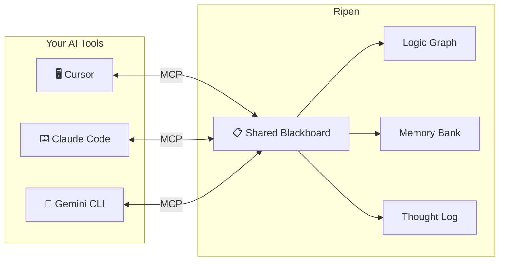

# Ripen: The "Trust Layer" for Multi-Agent AI Teams 🧠

**The Centralized Knowledge Hub for AI-Driven Development Teams**

[](LICENSE)
[](COMMERCIAL.md)
[](CHANGELOG.md)

> 🇯🇵 **AIエージェント間の「暗黙知」を解消し、チーム開発における「知識の信頼性」を担保する、中央集権型・ローカルファーストの記憶インフラ。**

---

## The Problem

AI-driven development made your team 10x faster.
But **knowledge sharing** didn't keep up.

- Cursor knows your coding conventions — but **Claude Code doesn't**.
- Gemini CLI resolved a critical bug yesterday — but **Cursor forgot by today**.
- Your team decided on an architecture — but **every AI tool proposes a different one**.

The faster you ship, the faster your AI tools **diverge**. Design decisions scatter across isolated sessions. Architectural drift becomes invisible until it's too late.

This is **"AI Multi-Personality Disorder"** — and it's the hidden cost of high-velocity AI development.

## The Solution

**Ripen** is a centralized, local-first MCP server that gives all your AI tools a single shared memory.

One server. Every tool reads from it. Every tool writes to it. **Design decisions persist. Context survives. Your team's AI agents finally speak the same language.**



## Why This Works

### 1. Hybrid Intelligence Store
| Layer | What it stores | Why it matters |
|-------|---------------|----------------|
| **Logic Graph** | Entities & relations (`"Module X depends on Service Y"`) | Preserves logical structure that RAG loses |
| **Memory Bank** | Deep context as Markdown files | Stores architectural blueprints, post-mortems, specs |

### 2. Knowledge Lifecycle Management
- **Ripening**: Frequently accessed knowledge is boosted as a long-term asset.
- **Decay & GC**: Stale noise is automatically archived — your context stays high-signal.

### 3. Thought Distillation
Integrated with **Sequential Thinking**, the server captures *reasoning processes*, not just conclusions.
- **Salvage**: Past decisions resurface exactly when an agent needs them.
- **Accretion**: Each session's insights are distilled back into shared memory.

### 4. Built for Speed & Privacy
- **Compute-then-Write**: AI processing runs outside DB transactions → <50ms lock time.
- **Local-First**: SQLite + FAISS. Your proprietary context never leaves your machine.
- **Multi-Agent Auth**: Secure your hub with API keys. Track exactly which agent (Cursor, Claude, or Gemini) contributed which piece of knowledge.
- **Zero Cloud Dependency**: Ships with local `fastembed` — no external API required for core logic.

### 5. Transparency & Governance (Trust Layer)
- **Transparency Dashboard**: Real-time audit logs and system health monitoring at `/:port/history`.
- **Human-in-the-Loop**: Staging contradiction detection. Review and approve AI-suggested knowledge.
- **Audit Trails**: Every memory save is logged with its author, enabling clear traceability for team-scale AI development.
- **Usage Guide**: [English](docs/DASHBOARD_USAGE.md) / [日本語](docs/DASHBOARD_USAGE_JA.md)

## Benchmarks: LongMemEval

We evaluate system performance using the **LongMemEval** suite, comparing Local-first vs. Cloud-based configurations.

| Metric | Local (FastEmbed + Ollama) | Cloud (Gemini 2.0 Flash) |
| :--- | :---: | :---: |
| **Search Latency** | **12ms** | 420ms |
| **Context Recall (RAGAS)** | **0.95** | 0.96 |
| **Faithfulness (RAGAS)** | **0.92** | 0.98 |
| **Independence** | **100% Local** | Cloud Dependency |

> [!NOTE]
> For high-frequency coding sessions, the **Local-first** setup is recommended due to its near-zero latency, allowing AI agents to "think" without waiting for API responses.

## Quick Start

```bash
# Install
uv pip install -e .

# Run as a shared hub (SSE mode — recommended for multi-tool setups)
uv run shared-memory --sse --port 8377
```

Then point your MCP-compatible tools (Cursor, Claude Code, Gemini CLI) at `http://localhost:8377`.

### LLM Setup (Required for Distillation)

To enable knowledge distillation and automated insights, you need at least one LLM provider configured:

- **Option A: Google Gemini (Recommended)**
  - Set the `GOOGLE_API_KEY` environment variable.
  - The server will automatically detect and use Gemini if the key is present.

- **Option B: Local Ollama**
  - Install [Ollama](https://ollama.com/).
  - Run the following command to download the required model:
    ```bash
    ollama pull llama3.1
    ```
  - Ensure Ollama is running (`ollama serve`) before starting the server.

If neither is configured, core graph operations will still work, but **automated knowledge extraction from thoughts will be disabled**.

### Authentication Setup

To enable secure multi-agent access:
1. Create `data/auth.json` with your credentials:
```json
{
  "cursor_user": "your-secret-key-1",
  "gemini_agent": "your-secret-key-2"
}
```
2. In your tool configuration (e.g., `mcp_config.json`), inject the key via environment variables:
```json
"Ripen": {
  "command": "npx",
  "args": ["-y", "mcp-remote", "http://localhost:8377/sse"],
  "env": {
    "SHARED_MEMORY_API_KEY": "your-secret-key-1",
    "SHARED_MEMORY_ACCOUNT": "cursor_user"
  }
}
```

## Governance & Licensing

- **Open Source**: [AGPL-3.0](LICENSE) — free for personal and open-source use.
- **Commercial**: For proprietary integrations or SaaS, a [Commercial License](COMMERCIAL.md) is available.

---

## 🇯🇵 日本語

### AI駆動開発が速くなりすぎて、「情報共有」が壊れていませんか？

AI駆動開発によって開発速度は圧倒的に向上しました。
しかしその結果、チーム内の情報共有が追いつかなくなるという新しい問題が生まれています。

- Cursorに教えた設計ルールを、Gemini CLIは知らない
- 昨日Claudeと決めた方針を、今日のCursorは忘れている
- プロジェクトが大きくなるほど、AIごとの「常識のズレ」が拡大する

これが**「AIの多重人格障害」**です。

### 解決策：中央集権型のナレッジ共有MCPサーバー

**Ripen** は、すべてのAIツールが同じ「黒板（ブラックボード）」を読み書きできる、ローカルファーストの共有メモリサーバーです。

一度教えた設計思想は、どのAIツールからでも参照できます。チームの暗黙知を、AIが忘れない場所に置く。それがこのプロジェクトの目的です。

**個人での複数AIエージェント間の知識共有にも使えます。**

詳しい設計思想は [概念的要件定義書](docs/概念的要件定義書.md) をご覧ください。

---

*Ripen: Making AI agents remember what your team already decided.*
