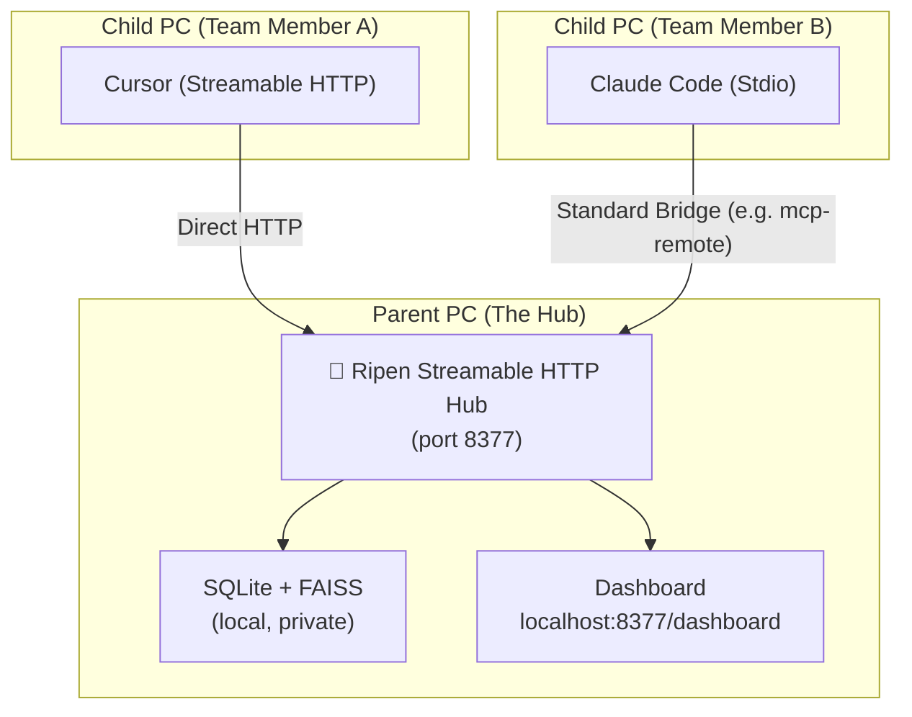

# Ripen: The "Trust Layer" for Multi-Agent AI Teams 🧠

**Centralized Knowledge Hub for AI-Driven Development. Designed for Local and Small-Team workflows.**

[](LICENSE)
[](CHANGELOG.md)
[](https://github.com/ayato-labs/ripen/pkgs/container/ripen)
[](https://github.com/ayato-labs/ripen/releases)

> [!IMPORTANT]
> **Official Distribution**: We distribute Ripen primarily as a standalone Windows native binary (`Ripen.exe`). 
> 
> **Notice on Docker Policy**: We have discontinued Docker image distribution due to potential licensing issues in corporate environments. Since Ripen only requires a single Windows machine to be running in your network, all other AI agents can connect and interact with it simply via HTTP. Therefore, cross-platform compatibility is practically complete without needing complex containerization. We have consolidated our distribution into Windows `.exe` binaries and Python source execution.

> [!TIP]
> **🚀 Special Campaign: 180-Day Free Professional License!**
> To celebrate our launch, we are distributing **180-Day Professional Licenses for FREE**!
> **Features**: Unlimited sync, commercial rights, and priority updates.
> **How to Apply**: Open a [GitHub Issue](https://github.com/ayato-labs/ripen/issues/new?title=Request+Pro+License) or email [cwblog69@gmail.com](mailto:cwblog69@gmail.com).
> **Activation**: `ripen-admin.exe license activate ./license.rpn`

> 🇯🇵 **Claude Code・Cursor・Antigravity・Gemini CLI——違うアカウントを使った別の人のPCで稼働するAIエージェントとの間でも、知識を共有できる。これが Ripen の根本的な価値です。**

---

## What Makes Ripen Different

Most MCP memory servers run in `stdio` mode — a 1:1 connection between **one IDE and one server**. Knowledge stays siloed inside that single process, invisible to any other tool or person.

**Ripen runs as a Streamable HTTP Hub** — an HTTP server that accepts **N:1 connections**. Multiple agents, multiple IDEs, multiple teammates on **different machines with different accounts**, all reading and writing to the same shared brain simultaneously.

> **Note on Scale**: Ripen is currently optimized for **local multi-agent usage or small teams (2-3 people)**. It uses SQLite + WAL mode under the hood, which provides excellent local concurrency but is not designed for high-throughput network writes from large distributed teams.

> **Privacy Warning**: Ripen uses background processes (`incremental_distill_knowledge`) to organize memory. **If you configure an external LLM (like Gemini or OpenAI), snippets of your codebase and prompts may be sent to these external APIs.** For strict enterprise environments, we strongly recommend using a local LLM via Ollama.

```text
[Typical MCP Memory]                    [Ripen Hub Mode]

Dev A: Cursor   -- memory-A             Dev A: Cursor     ----+
Dev A: Claude   -- memory-B             Dev A: Antigravity ---+
                                        Dev B: Windsurf    ---+--> Ripen HTTP Hub
Dev B: Cursor   -- memory-C             Dev B: Gemini CLI  ---+
                                        CI Agent -------------+
  No shared knowledge                   Zero manual sync
```

This is the **core innovation**: automated cross-agent, cross-user, cross-machine knowledge sharing via a local Streamable HTTP server.

---

## Quick Start

Ripen operates purely as a centralized Hub. You host it once, and all your agents connect to it.

### 1. Start the Hub
1. Download `ripen-hub.exe` and `ripen-admin.exe` from the latest release.
2. Set the `GOOGLE_API_KEY` (or other provider keys) in the environment variables on the machine running the Hub. **Clients do not need to hold any API keys.**
3. Run `ripen-hub.exe`. It will start the Streamable HTTP server on port `8377`.

### 2. Connect Your Agents
Configure your AI agents to connect to the Hub's MCP endpoint.

*   **For Cursor (Highly Recommended)**:
    Add a new MCP server in Cursor settings with the following configuration:
    - **Type**: `streamableHttp`
    - **URL**: `http://localhost:8377/mcp`

    Or, if you prefer editing the configuration file (e.g., `mcp_config.json` or `mcp.json` depending on the tool) directly, add the following entry to your `"mcpServers"` section:
    ```json
    "Ripen": {
      "type": "streamableHttp",
      "serverURL": "http://localhost:8377/mcp"
    }
    ```

*   **For Team Use (Remote Connection)**:
    If you are connecting from a different machine (Child PC) to a shared Hub (Parent PC), replace `localhost` with the Parent PC's actual IP address:
    - **URL**: `http://<Parent_PC_IP>:8377/mcp`
    
    *Note: By default, the Ripen Server is configured to listen on `0.0.0.0`, meaning it accepts connections from any IP address reaching the host machine.*

---

## The Problem: AI "Multi-Personality Disorder"

AI-driven development made your team 10x faster, but your knowledge is now scattered:

- **Isolated Context**: Cursor knows your coding conventions — but **Claude Code doesn't**.
- **Memory Decay**: Gemini CLI resolved a bug yesterday — but **Cursor forgot it by today**.
- **Architectural Drift**: Your team decided on a pattern — but **every AI tool proposes a different one**.
- **Cross-User Silos**: Developer A's AI made a key decision — but **Developer B's AI has no idea**.

The faster you ship, the faster your AI tools **diverge**. Ripen stops this drift with a **Single Source of Truth (SSoT)** shared by every agent on your team.

---

## Architecture: Pure Hub Model

Ripen provides a unified HTTP Hub endpoint. No proprietary client proxies are needed.



---

## Key Features

### 1. Hybrid Intelligence Store
- **Logic Graph**: Stores entities and relations (e.g., *"AuthModule depends on UserService"*).
- **Memory Bank**: Stores deep context as Markdown (specs, blueprints, post-mortems).
- **Thought Log**: Captures the *reasoning process* behind decisions, not just the output.

### 2. Knowledge Lifecycle (The "Ripening" Process)
- **Maturation**: Frequently accessed knowledge is automatically "ripened" into stable long-term assets.
- **Decay & GC**: Stale or transient noise is automatically archived to keep context high-signal.

### 3. Zero-Config by Design
- LLM not configured? Core search, graph, and Memory Bank still work fully.
- Config priority: `Environment Variable` > `~/.ripen/config.json` > Defaults.
- Hub startup prints a summary of active services and the connection URL.

### 4. Professional CLI
| Command | Role |
|---------|------|
| `ripen-hub.exe` | Start the main Streamable HTTP server |
| `ripen-admin.exe` | Knowledge maintenance, GC, and license management |

### 5. Observability Dashboard
Visit `http://localhost:8377/dashboard` to see:
- **Active Agents**: Which IDEs/tools are currently connected
- **Knowledge Flow**: Real-time activity timeline
- **Hub Status**: Real-time status of AI Brain (LLM) and Memory Bank (Vector DB)

### 6. Reliability & Health Monitoring (Plan A Strategy)
Ripen prioritizes **system stability** over massive internal dependencies.
- **Proactive Health Checks**: The Hub automatically detects if Ollama or Gemini are available.
- **Zero-Crash Lifespan**: Instead of failing silently or crashing during heavy inference, Ripen provides clear visual warnings in the Dashboard and CLI if a backend is missing.
- **Dependency-Clean**: By leveraging FastEmbed for retrieval and "Bringing Your Own LLM" for reasoning, we ensure the Hub remains lightweight enough to run in the background of any 16GB RAM development machine.

---

## Benchmarks: LongMemEval

| Metric | Local (FastEmbed + Ollama) | Cloud (Gemini 2.0 Flash) |
| :--- | :---: | :---: |
| **Search Latency** | **12ms** | 420ms |
| **Context Recall (RAGAS)** | **0.95** | 0.96 |
| **Independence** | **100% Local** | Cloud Dependency |

---

## Installation

### Option A: Docker (Recommended for Engineers) 🐳
The most stable and easiest way to run the Ripen Hub. No Python required. Works on Windows, Mac, and Linux.
Data is persisted in a Docker named volume (`ripen_data`) to avoid SQLite lock issues on Windows.

#### 1. Install (取得)
```bash
docker pull ghcr.io/ayato-labs/ripen:latest
```

#### 2. Start (起動)

**Method A: Docker Compose (Recommended)**
Use the provided `docker-compose.yml` to automatically handle volume mounting and environment variables.

1. **Set your Configuration**:
   Create a `.env` file in the same directory as `docker-compose.yml`.
   
   **For Gemini (Default)**:
   ```env
   LLM_PROVIDER=gemini
   GEMINI_API_KEY=your_actual_api_key_here
   ```
   
   > [!NOTE]
   > **Embedding Engine について**:
   > `LLM_PROVIDER=gemini` を指定した場合でも、デフォルトでは Embedding（埋め込み）エンジンとして `fastembed` が使用されます。
   > Embedding も Gemini に統一したい場合は、`.env` ファイルに以下の行を追加してください。
   > ```env
   > EMBEDDING_ENGINE=gemini
   > ```
   > 追加後は、`docker compose down` を実行してから再度 `docker compose up` を行ってください。
   
   **For Ollama (Local)**:
   ```env
   LLM_PROVIDER=ollama
   OLLAMA_BASE_URL=http://localhost:11434
   GENERATIVE_MODEL=gemma4:e2b
   ```

2. **Start**:
   ```bash
   docker compose up -d
   ```

**Method B: Docker Run**
Run the container manually.

**For Gemini**:
```bash
docker run --name ripen-hub -p 8377:8377 -v ripen_data:/data -e GEMINI_API_KEY=your_api_key ghcr.io/ayato-labs/ripen:latest
```

**For Ollama**:
```bash
docker run --name ripen-hub -p 8377:8377 -v ripen_data:/data -e LLM_PROVIDER=ollama -e OLLAMA_BASE_URL=http://host.docker.internal:11434 -e GENERATIVE_MODEL=gemma4:e2b ghcr.io/ayato-labs/ripen:latest
```
*Note: `host.docker.internal` is used to access Ollama running on the host machine. If you want to run it in the background, add the `-d` option.*

#### 3. Update (更新)
To update Ripen to the latest version while keeping your stored knowledge:
```bash
# 1. Pull the latest image
docker pull ghcr.io/ayato-labs/ripen:latest

# 2. Stop the current container
docker stop ripen-hub

# 3. Rename the old container to preserve logs (Recommended)
# (Replace 20260516 with today's date / 本日の日付に置き換えてください)
docker rename ripen-hub ripen-hub-old-20260516

# 4. Start the new container with the same volume (Gemini example)
docker run --name ripen-hub -p 8377:8377 -v ripen_data:/data -e GEMINI_API_KEY=your_api_key ghcr.io/ayato-labs/ripen:latest
```
*Note: If you want to run it in the background, add the `-d` option.*

#### 4. Uninstall (削除)
To completely remove the container, image, and persisted data:
```bash
# Stop and remove the container
docker stop ripen-hub && docker rm ripen-hub

# Remove the image
docker rmi ghcr.io/ayato-labs/ripen:latest

# Remove the volume (WARNING: This will delete all your stored knowledge!)
docker volume rm ripen_data
```

### Option B: Native Binary (Windows Only) 🚀
For Windows users who prefer a standalone executable.
1. Download `Ripen.exe`, `RipenInstaller.exe`, and `RipenInit.exe` from [GitHub Releases](https://github.com/ayato-labs/ripen/releases).
2. **Initial Setup (Mandatory)**: Before running the main server, run `RipenInit.exe` to launch the interactive setup wizard. It will guide you through configuring:
   - **Data Directory**: The local path where databases and vectors are stored (Default: `~/.ripen/`).
   - **LLM Provider**: Choose between `gemini`, `ollama`, or `none`.
   - **Credentials**: Enter your Google Gemini API Key (if `gemini` is selected) or local Ollama URL & model details (if `ollama` is selected).
   
   This wizard automatically generates `~/.ripen/config.json`.
3. **Start the Hub**: Run `Ripen.exe` to start the Streamable HTTP server. It will automatically load the configuration from `config.json` on startup.

### Option C: Python (Source)
```bash
# Make sure to set PYTHONPATH to src
PYTHONPATH=src uv run python -m ripen.api.server
```

---

## 🇯🇵 日本語

### 他のMCPメモリサーバーとの根本的な違い
Ripen は「1対1」ではなく「N対1」の接続を前提とした**ナレッジ・ハブ**です。
*   **従来**: 1つのIDEごとに独立したメモリ（知識が分散する）。
*   **Ripen**: 全員が1つの「共有ブレイン」に接続（知識がリアルタイムで同期する）。

---

### 🚀 ハブの起動手順（管理者・ホストPC向け）

Windows環境でネイティブバイナリ（.exe）を使用して共有のナレッジハブを起動する手順です。

1. [GitHub Releases](https://github.com/ayato-labs/ripen/releases) から `Ripen.exe`、`RipenInstaller.exe`、および `RipenInit.exe` をダウンロードします。
2. **初期セットアップ（必須）**: 
   メインサーバーを起動する前に、まず `RipenInit.exe` を実行して対話式のセットアップウィザードを完了させてください。ウィザードでは以下の項目を設定します。
   - **データ保存先**: データベースやベクトルデータなどを保存するローカルディレクトリ（デフォルト: `~/.ripen/`）。
   - **LLMプロバイダ**: 知識の整理・蒸留に使用する LLM（`gemini` / `ollama` / `none`）。
   - **APIキー/接続設定**: `gemini` 選択時は Google API キーの入力、`ollama` 選択時は Ollama の接続 URL とモデル名の入力。
   
   この操作により、自動的に設定ファイル `~/.ripen/config.json` が生成されます。
3. **サーバーの起動**:
   `Ripen.exe` を実行して Streamable HTTP サーバーを起動します。起動時に `config.json` の設定が自動的に読み込まれます。

---

### 🌐 チーム開発：メンバーの接続手順

管理者が構築した共有ハブに接続するためのガイドです。

管理者から親機の URL （例: `http://192.168.1.50:8377/mcp`）を共有してもらいます。

#### 2. 接続設定
各 AI ツールに、以下の設定を入力します。

**Cursor / Windsurf 等の SSE（Streamable HTTP）クライアントの場合**
1. 各ツールの MCP 設定を開く。
2. `Type` を **SSE** に指定。
3. `URL` に `http://[親機のIP]:8377/mcp` を入力。

#### 3. 動作確認
エージェントに「このプロジェクトの規約を教えて」と聞いてみてください。親機に蓄積された知識を答えられれば成功です！

---

一般的なMCPメモリサーバーは `stdio` モードで動作し、**1つのIDEと1つのサーバー**が1:1で接続されます。知識はそのIDEのプロセス内に閉じており、他のツールや他のユーザーからは参照できません。

**Ripenは `Streamable HTTP Hub` として動作します。** HTTPサーバーとして常駐し、複数のIDE・複数のメンバーが同時に読み書きできます。

> **Docker配布の取りやめとマルチOS対応について**
> 企業や商用環境での利用時に懸念されるDocker Desktop等のライセンス問題を考慮し、Dockerによるコンテナ配布方針は取りやめました。
> .exeオンリーにした理由については、このRipenはWindows環境が一台あったら、その他のAIエージェントはHTTP通信をするだけであるので、ほとんどすでにマルチOS対応は完了しているも同然であると判断して、ライセンスの問題があるdockerでの配布方針を取りやめました。
> チーム内にWindows環境が1台稼働していれば、MacやLinuxなど他のOSを使うメンバーのAIエージェントはHTTP通信（SSE）で接続するだけで利用可能です。これにより、配布形態をライセンス問題のないWindows `.exe` およびPythonソース起動に一本化しています。

> **最大のポイント**: Claude Code・Cursor・Antigravity・Gemini CLI の間で知識を共有できます。しかも、**違うアカウントを使った別の人のPCで稼働するAIエージェントとの間でも。**

これは「便利な追加機能」ではなく、エージェントフレームワークが構造的に実現不可能な**唯一の機能**です。

詳細は [概念的要件定義書](docs/概念的要件定義書.md) · [アーキテクチャ](docs/アーキテクチャ.md) をご覧ください。
3. `URL` に `http://[親機のIP]:8377/mcp` を入力。

#### 3. 動作確認
エージェントに「このプロジェクトの規約を教えて」と聞いてみてください。親機に蓄積された知識を答えられれば成功です！

---

一般的なMCPメモリサーバーは `stdio` モードで動作し、**1つのIDEと1つのサーバー**が1:1で接続されます。知識はそのIDEのプロセス内に閉じており、他のツールや他のユーザーからは参照できません。

**Ripenは `Streamable HTTP Hub` として動作します。** HTTPサーバーとして常駐し、複数のIDE・複数のメンバーが同時に読み書きできます。

> **最大のポイント**: Claude Code・Cursor・Antigravity・Gemini CLI の間で知識を共有できます。しかも、**違うアカウントを使った別の人のPCで稼働するAIエージェントとの間でも。**
>
> これは「便利な追加機能」ではなく、エージェントフレームワークが構造的に実現不可能な**唯一の機能**です。

詳細は [概念的要件定義書](docs/概念的要件定義書.md) · [アーキテクチャ](docs/アーキテクチャ.md) をご覧ください。

---

## Data Governance & Privacy 🛡️

Your knowledge is your most valuable asset. Ripen is designed to give you full control over it:

- **Local-First**: All data is stored on your machine in a single SQLite database.
- **Data Location**: By default, everything lives in `~/.ripen/` (Windows: `C:\Users\<User>\.ripen`).
- **Portability**: To backup or migrate, simply copy the `~/.ripen/knowledge.db` file.

---

## Donations & Support ☕

開発者への寄付やサポートをご検討いただける場合、以下のサービスをご利用いただけます。
日本在住のため Stripe や GitHub Sponsors が利用できないため、**OFUSE (オフセ)** を通じてご支援いただければ幸いです。

👉 **[OFUSE で Ripen を支援する](https://ofuse.me/21cfc1d2)**

---

## License

- **Open Source**: [AGPL-3.0](LICENSE) — free for personal and open-source use.
- **Commercial**: For proprietary team integrations, a [Commercial License](COMMERCIAL.md) is available. 
  - **180-day (6-month) free trial** is standard for all teams.
  - **Special Campaign**: Currently, 180-day Professional Licenses are being distributed for **FREE**. 
  - **Why Free?**: Ripen is open-sourced under AGPL-3.0. We have implemented a strict licensing model specifically to prevent unauthorized "copy-and-sell" practices by third parties while ensuring the community and developers can use it safely and freely.

*Ripen: Making AI agents remember what your team already decided.*
