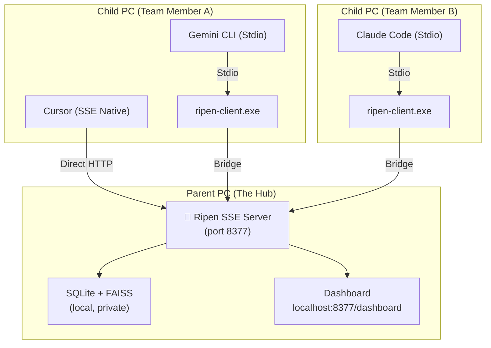

# Ripen: The "Trust Layer" for Multi-Agent AI Teams 🧠

**Centralized Knowledge Hub for AI-Driven Development. Designed for Local and Small-Team workflows.**

[](https://pypi.org/project/ripen/)
[](LICENSE)
[](CHANGELOG.md)
[](https://github.com/ayato-labs/ripen/releases)

> [!IMPORTANT]
> **Official Distribution**: Always download `ripen.exe` from the [Official GitHub Releases](https://github.com/ayato-labs/ripen/releases). This ensures you have the latest signed binary with all security patches.

> [!TIP]
> **🚀 Special Campaign: 180-Day Free Professional License!**
> To celebrate our launch, we are distributing **180-Day Professional Licenses for FREE**!
> **Features**: Unlimited sync, commercial rights, and priority updates.
> **How to Apply**: Open a [GitHub Issue](https://github.com/ayato-labs/ripen/issues/new?title=Request+Pro+License) or email [cwblog69@gmail.com](mailto:cwblog69@gmail.com).
> **Activation**: `ripen-admin license activate ./license.rpn`

> 🇯🇵 **Claude Code・Cursor・Antigravity・Gemini CLI——違うアカウントを使った別の人のPCで稼働するAIエージェントとの間でも、知識を共有できる。これが Ripen の根本的な価値です。**

---

## What Makes Ripen Different

Most MCP memory servers run in `stdio` mode — a 1:1 connection between **one IDE and one server**. Knowledge stays siloed inside that single process, invisible to any other tool or person.

**Ripen runs as an SSE Hub** — an HTTP server that accepts **N:1 connections**. Multiple agents, multiple IDEs, multiple teammates on **different machines with different accounts**, all reading and writing to the same shared brain simultaneously.

> **Note on Scale**: Ripen is currently optimized for **local multi-agent usage or small teams (2-3 people)**. It uses SQLite + WAL mode under the hood, which provides excellent local concurrency but is not designed for high-throughput network writes from large distributed teams.

> **Privacy Warning**: Ripen uses background processes (`incremental_distill_knowledge`) to organize memory. **If you configure an external LLM (like Gemini or OpenAI), snippets of your codebase and prompts may be sent to these external APIs.** For strict enterprise environments, we strongly recommend using a local LLM via Ollama.

```
[Typical MCP Memory]                    [Ripen Hub Mode]

Dev A: Cursor   -- memory-A             Dev A: Cursor     ----+
Dev A: Claude   -- memory-B             Dev A: Antigravity ---+
                                        Dev B: Claude Code ---+--> Ripen Hub
Dev B: Cursor   -- memory-C             Dev B: Gemini CLI  ---+
                                        CI Agent -------------+
  No shared knowledge                   Zero manual sync
```

This is the **core innovation**: automated cross-agent, cross-user, cross-machine knowledge sharing via a local SSE server.

---

## Quick Start: Two Setup Patterns

Ripen supports two primary workflows. Choose the one that fits your team structure:

### 🏠 Pattern A: Personal Hub (Single User, Multiple Agents)
Use this if you are a solo developer using multiple tools (Cursor + Gemini CLI + Claude) on one machine.

1.  **Start Hub**: Run `bin/sse.bat` and select `[1] Local Only`.
2.  **Connect Agents**:
    *   **Cursor**: Add MCP server `http://localhost:8377/sse` (Type: SSE).
    *   **CLI Tools**: Use the standard `ripen --stdio` proxy in your config.

### 🌐 Pattern B: Team Hub (Shared Brain for the Team)
Use this if you want to share knowledge across different people and different machines.

1.  **Start Hub (Parent PC)**: Run `bin/sse.bat` and select `[2] Team/Public`.
2.  **Distribute Client (To Teammates)**:
    *   Run `scripts/build_client.bat` to generate `dist/client/ripen-client.exe`.
    *   Send this EXE to your teammates.
3.  **Connect (Child PCs)**:
    *   Teammates run `bin/connect_to_hub.bat` and enter your Parent PC's IP address.
    *   Their AI agents now read and write to your shared knowledge base.

---

## The Problem: AI "Multi-Personality Disorder"

AI-driven development made your team 10x faster, but your knowledge is now scattered:

- **Isolated Context**: Cursor knows your coding conventions — but **Claude Code doesn't**.
- **Memory Decay**: Gemini CLI resolved a bug yesterday — but **Cursor forgot it by today**.
- **Architectural Drift**: Your team decided on a pattern — but **every AI tool proposes a different one**.
- **Cross-User Silos**: Developer A's AI made a key decision — but **Developer B's AI has no idea**.

The faster you ship, the faster your AI tools **diverge**. Ripen stops this drift with a **Single Source of Truth (SSoT)** shared by every agent on your team.

---

## Architecture: Hub & Spokes



### Which role should I take?

| Role | Responsibility | Requirement |
| :--- | :--- | :--- |
| **Parent (Hub)** | Hosts the knowledge base and runs background distillation. | Full Python environment, LLM API Key, keeps `sse.bat` running. |
| **Child (Spoke)** | Connects to the Hub to read/write knowledge. | **Zero Install.** Just needs `ripen-client.exe` and the Parent's IP. |

---

## Team Deployment Guide

### 1. Preparing the Hub (Parent)
On the computer that will host the memory (can be a server or a leader's workstation):
1.  Ensure you have Python 3.10+ and `uv` installed.
2.  Run `bin/sse.bat`.
3.  Choose **Option [2] Team/Public**.
4.  **Important**: Note your IP address (run `ipconfig` to find it). Ensure your Firewall allows inbound traffic on port `8377`.

### 2. Distributing the Connector
You don't need to share your whole source code or credentials.
1.  Run `scripts/build_client.bat`.
2.  This generates a single, lightweight binary: `dist/client/ripen-client.exe`.
3.  Share this EXE with your teammates via Slack, Discord, or shared drive.

### 3. Connecting Teammates (Child)
On the teammate's machine:
1.  Place `ripen-client.exe` in a stable folder.
2.  Run `bin/connect_to_hub.bat`.
3.  Enter the Parent's IP (e.g., `http://192.168.1.50:8377`).
4.  **Done.** Their AI agents are now synchronized with yours.

> [!WARNING]
> **Data Privacy**: Teammates connecting to your Hub will be able to read all knowledge currently in the Hub. Use this for trusted team collaborations only. For isolation, use separate data directories via the `--data-dir` flag.

---
graph TD
    subgraph "Ripen Hub (runs once, on a team server or localhost)"
        H["🧠 Ripen SSE Server\n(port 8377)"]
        H --> DB["SQLite + FAISS\n(local, private)"]
        H --> DASH["Dashboard\nlocalhost:8377/dashboard"]
    end

    subgraph "Developer A のPC"
        A1["🖥️ Cursor"] -->|MCP SSE| H
        A2["🤖 Antigravity"] -->|MCP SSE| H
    end

    subgraph "Developer B のPC（別アカウント）"
        B1["⌨️ Claude Code"] -->|MCP SSE| H
        B2["🔧 Gemini CLI"] -->|MCP SSE| H
    end

    subgraph "CI / Automation"
        C1["⚙️ GitHub Actions Agent"] -->|MCP SSE| H
    end
```

**One Hub. N Clients. Different PCs. Different accounts. Zero manual sync.**

---

## Key Features

### 1. Hybrid Intelligence Store
- **Logic Graph**: Stores entities and relations (e.g., *"AuthModule depends on UserService"*).
- **Memory Bank**: Stores deep context as Markdown (specs, blueprints, post-mortems).
- **Thought Log**: Captures the *reasoning process* behind decisions, not just the output.

### 2. Knowledge Lifecycle (The "Ripening" Process)
- **Maturation**: Frequently accessed knowledge is automatically "ripened" into stable long-term assets.
- **Decay & GC**: Stale or transient noise is automatically archived to keep context high-signal.

### 3. Zero-Config by Design
- LLM not configured? Core search, graph, and Memory Bank still work fully.
- Config priority: `Environment Variable` > `~/.ripen/config.json` > Defaults.
- Hub startup prints a summary of active services and the **Client Connection URL**.

### 4. Professional CLI
| Command | Role |
|---------|------|
| `ripen --sse` | Start the Hub server |
| `ripen-init` | Interactive wizard (Hub or Client mode) |
| `ripen-register --hub-url <url>` | Register any IDE to a remote Hub |
| `ripen-admin` | Knowledge maintenance and GC |

### 5. Observability Dashboard
Visit `http://localhost:8377/dashboard` to see:
- **Active Agents**: Which IDEs/tools are currently connected
- **Knowledge Flow**: Real-time activity timeline
- **Hub Status**: Real-time status of AI Brain (LLM) and Memory Bank (Vector DB)

### 6. Reliability & Health Monitoring (Plan A Strategy)
Ripen prioritizes **system stability** over massive internal dependencies.
- **Proactive Health Checks**: The Hub automatically detects if Ollama or Gemini are available.
- **Zero-Crash Lifespan**: Instead of failing silently or crashing during heavy inference, Ripen provides clear visual warnings in the Dashboard and CLI if a backend is missing.
- **Dependency-Clean**: By leveraging FastEmbed for retrieval and "Bringing Your Own LLM" for reasoning, we ensure the Hub remains lightweight enough to run in the background of any 16GB RAM development machine.

---

## Benchmarks: LongMemEval

| Metric | Local (FastEmbed + Ollama) | Cloud (Gemini 2.0 Flash) |
| :--- | :---: | :---: |
| **Search Latency** | **12ms** | 420ms |
| **Context Recall (RAGAS)** | **0.95** | 0.96 |
| **Independence** | **100% Local** | Cloud Dependency |

---

## Installation

### Option A: Native Binary (Easiest for Windows) 🚀
No Python required. Best for a quick, stable setup.
1. Download `ripen.exe` from [GitHub Releases](https://github.com/ayato-labs/ripen/releases).
2. Run `ripen.exe init` in your terminal to set up your Hub or Client.
3. Use the generated Desktop shortcut to start Ripen anytime.

### Option B: Zero-install (For Python users)
```bash
uvx ripen --sse        # Start Hub
uvx ripen-init         # Setup wizard
```

### Option C: Persistent install
```bash
pip install ripen
ripen-init
```

### Option D: Docker (Team Hub)
```bash
docker run -d -p 8377:8377 -v ripen_data:/data ghcr.io/ayato-labs/ripen
```

---

## 🇯🇵 日本語

### 他のMCPメモリサーバーとの根本的な違い
Ripen は「1対1」ではなく「N対1」の接続を前提とした**ナレッジ・ハブ**です。
*   **従来**: 1つのIDEごとに独立したメモリ（知識が分散する）。
*   **Ripen**: 全員が1つの「共有ブレイン」に接続（知識がリアルタイムで同期する）。

---

### 🌐 チーム開発：子機（メンバー）の接続手順

管理者が構築した共有ハブに接続するためのガイドです。

#### 1. 準備
管理者から以下の 2 つを受け取ってください。
*   `ripen-client.exe` （軽量な接続用プログラム）
*   親機の URL （例: `http://192.168.1.50:8377`）

#### 2. 接続設定
各 AI ツールに、以下の設定を入力します。

**A. Cursor の場合（SSE接続）**
一番高速な接続方法です。
1.  Cursor の MCP 設定を開く。
2.  `Type` を **SSE** に変更。
3.  `URL` に `http://[親機のIP]:8377/sse` を入力。

**B. その他のエージェント（Stdio接続）**
`ripen-client.exe` を「翻訳機」として使います。
`mcp_config.json` 等に以下のように記述してください：
```json
"ripen": {
  "command": "C:/パス/to/ripen-client.exe",
  "args": ["http://[親機のIP]:8377"]
}
```

#### 3. 動作確認
エージェントに「このプロジェクトの規約を教えて」と聞いてみてください。親機に蓄積された知識を答えられれば成功です！

---

一般的なMCPメモリサーバーは `stdio` モードで動作し、**1つのIDEと1つのサーバー**が1:1で接続されます。知識はそのIDEのプロセス内に閉じており、他のツールや他のユーザーからは参照できません。

**Ripenは `SSEハブ` として動作します。** HTTPサーバーとして常駐し、複数のIDE・複数のメンバーが同時に読み書きできます。

> **最大のポイント**: Claude Code・Cursor・Antigravity・Gemini CLI の間で知識を共有できます。しかも、**違うアカウントを使った別の人のPCで稼働するAIエージェントとの間でも。**
>
> これは「便利な追加機能」ではなく、エージェントフレームワークが構造的に実現不可能な**唯一の機能**です。

### セットアップ

**親機（Hub）側**: `ripen-init` → `hub` を選択 → 設定完了後に「接続URL」が表示される

**子機（Client）側**: `ripen-init` → `client` を選択 → Hub の URL を入力 → 全IDEに自動登録完了

詳細は [概念的要件定義書](docs/概念的要件定義書.md) · [配信計画](docs/配信計画.md) · [アーキテクチャ](docs/アーキテクチャ.md) をご覧ください。

---

## Data Governance & Privacy 🛡️

Your knowledge is your most valuable asset. Ripen is designed to give you full control over it:

- **Local-First**: All data is stored on your machine in a single SQLite database.
- **Data Location**: By default, everything lives in `~/.ripen/` (Windows: `C:\Users\<User>\.ripen`).
- **Portability**: To backup or migrate, simply copy the `~/.ripen/knowledge.db` file.
- **Complete Erasure**: If you decide to stop using Ripen and want to ensure no data is left behind, run:
  ```bash
  ripen --uninstall
  ```
  This will permanently delete the database, configurations, and shortcuts.

---

## Donations & Support ☕

開発者への寄付やサポートをご検討いただける場合、以下のサービスをご利用いただけます。
日本在住のため Stripe や GitHub Sponsors が利用できないため、**OFUSE (オフセ)** を通じてご支援いただければ幸いです。

👉 **[OFUSE で Ripen を支援する](https://ofuse.me/21cfc1d2)**

---

## License

- **Open Source**: [AGPL-3.0](LICENSE) — free for personal and open-source use.
- **Commercial**: For proprietary team integrations, a [Commercial License](COMMERCIAL.md) is available. 
  - **180-day (6-month) free trial** is standard for all teams.
  - **Special Campaign**: Currently, 180-day Professional Licenses are being distributed for **FREE**. 
  - **Why Free?**: Ripen is open-sourced under AGPL-3.0. We have implemented a strict licensing model specifically to prevent unauthorized "copy-and-sell" practices by third parties while ensuring the community and developers can use it safely and freely.

*Ripen: Making AI agents remember what your team already decided.*
