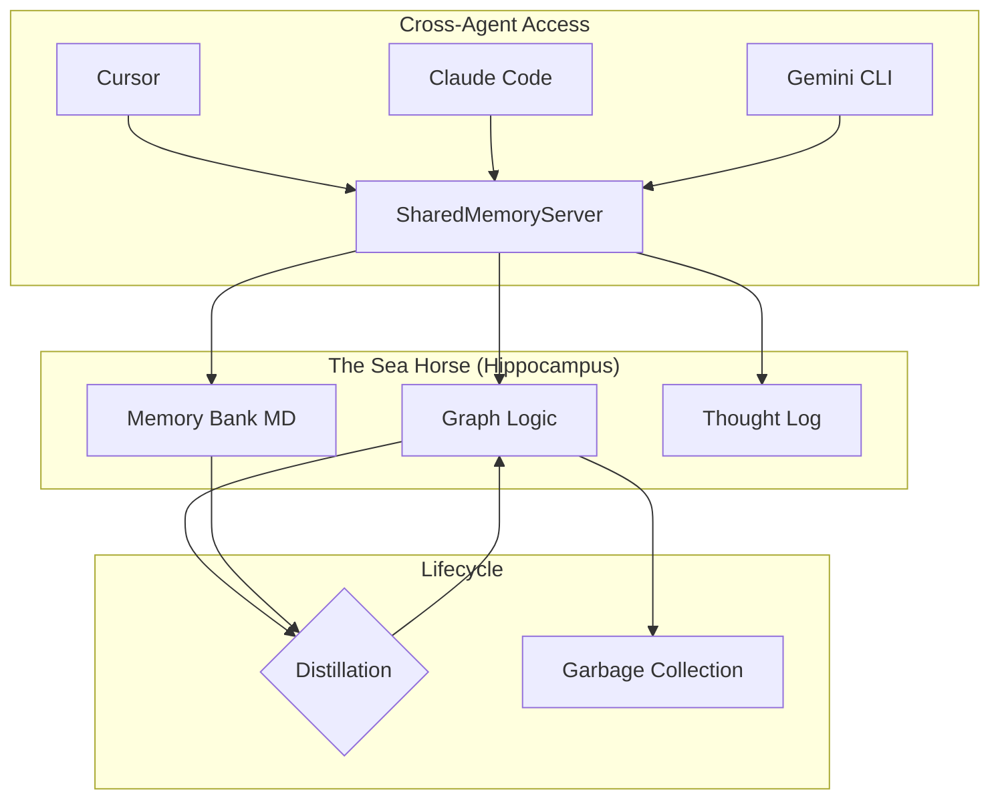

# SharedMemoryServer: The Central Nervous System for Cross-Agent Intelligence 🧠✨

[](LICENSE)
[](COMMERCIAL.md)
[](CHANGELOG.md)

> **"Why can't your AI agents share the same design principles?"**

If you've ever felt that **Cursor** knows your code, but **Claude Code** (in the terminal) is hallucinating the design, or **Gemini CLI** has forgotten the last 10 decisions you made — you've experienced **"AI Multi-Personality Disorder."**

SharedMemoryServer is the solution: A production-grade **Blackboard Architecture** for MCP that provides a persistent, structured, and evolving memory hub for ALL your AI tools simultaneously.

---

## 🎯 The Core Problem: Intelligence Fragmentation
Modern AI development isn't limited by context windows; it's limited by **Knowledge Decay** and **Context Silos**.
- **Naive RAG** fails to maintain logical structures (A depends on B).
- **Ephemeral Sessions** lose the "Why" behind a decision.
- **Disconnected Tools** lead to inconsistent code styles and architectural drift.

**SharedMemoryServer** bridges this gap by acting as the "Sea Horse" (Hippocampus) for your agentic ecosystem.

---

## 🏗️ Technical Pillars

### 1. Hybrid Intelligence Store (Graph + Bank)
- **Logic Graph**: Maintains entities and relations (e.g., "Module X depends on Service Y") to ensure logical consistency.
- **Memory Bank**: Stores deep context (Markdown files) for architectural blueprints and technical specifications.

### 2. Cognitive Lifecycle Management
- **Ripening**: Knowledge that is frequently accessed is boosted and preserved as a long-term asset.
- **Decay & GC**: Stale or low-signal "noise" is automatically archived to keep the context window high-signal (S/N ratio optimization).

### 3. Thought Distillation (Sequential Thinking)
Integrated with the **Sequential Thinking** protocol, the server doesn't just store data; it captures the *reasoning process*.
- **Salvage**: Automatically retrieves relevant past context during an agent's reasoning steps.
- **Accretion**: Distills the outcome of a session back into the core memory bank, ensuring knowledge grows with every task.

### 4. Performance & Governance
- **Compute-then-Write**: Heavy AI processing (Embeddings, Conflict Detection) happens outside DB transactions to ensure <50ms locking.
- **Local-First Privacy**: SQLite + FAISS (or local fastembed) ensures your proprietary design never leaves your host.
- **Traceability**: Comprehensive audit logs and "Reasoning Provenance" for every piece of knowledge.

---

## 📊 Architecture at a Glance



---

## ⚡ Quick Start

### 1. Install
```bash
uv pip install -e .
```

### 2. Run as a Central Hub (SSE Mode)
Recommended for keeping Cursor and Terminal tools in sync:
```bash
uv run shared-memory --sse --port 8377
```

### 3. Verify
Run the high-integrity test suite (Chaos, System, Unit):
```bash
uv run pytest tests -v
```

---

## 🛡️ Governance & Licensing
- **Open Source**: Licensed under [AGPL-3.0](LICENSE).
- **Commercial**: For proprietary integrations or SaaS use, a [Commercial License](COMMERCIAL.md) is available.

---
*SharedMemoryServer: Elevating AI agents from "disposable assistants" to "permanent engineering assets".*
