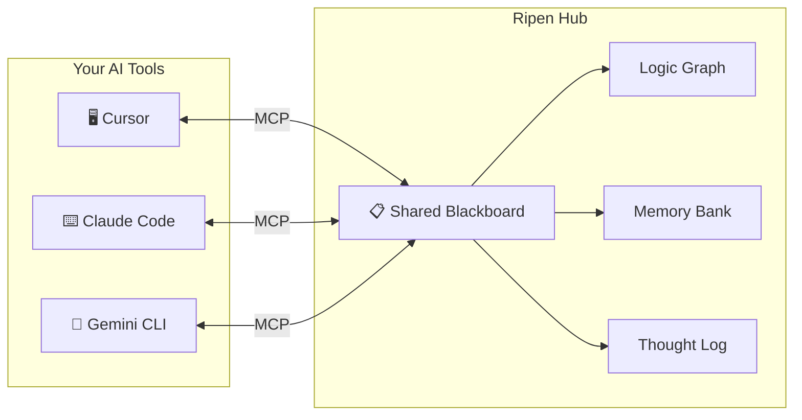

# Ripen: The "Trust Layer" for Multi-Agent AI Teams 🧠

**Centralized Knowledge Hub for AI-Driven Development. One memory, every tool.**

[](https://pypi.org/project/ripen/)
[](LICENSE)
[](CHANGELOG.md)

> 🇯🇵 **AIエージェント間の「暗黙知」を解消し、チーム開発における「知識の信頼性」を担保する、中央集権型・ローカルファーストの記憶インフラ。**

---

## 🚀 3-Minute Quick Start

The fastest way to give your AI agents a shared memory:

```bash
# 1. Run the server (Zero-config, no install required)
uvx ripen --sse

# 2. In a new terminal, run the setup wizard
uvx ripen-init
```

**That's it.** The wizard will guide you through LLM setup and automatically register Ripen with **Cursor**, **Claude Desktop**, and more.

---

## The Problem: AI "Multi-Personality Disorder"

AI-driven development made your team 10x faster, but your knowledge is now scattered:

- **Isolated Context**: Cursor knows your coding conventions — but **Claude Code doesn't**.
- **Memory Decay**: Gemini CLI resolved a bug yesterday — but **Cursor forgot it by today**.
- **Architectural Drift**: Your team decided on a pattern — but **every AI tool proposes a different one**.

The faster you ship, the faster your AI tools **diverge**. Ripen stops this drift by providing a **Single Source of Truth (SSoT)** for every agent in your workflow.

---

## The Solution: A Shared "Brain" for All Agents

**Ripen** is a centralized, local-first MCP server. One server. Every tool reads from it. Every tool writes to it.



---

## Key Features

### 1. Hybrid Intelligence Store
- **Logic Graph**: Stores entities and relations (e.g., *"Module X depends on Service Y"*).
- **Memory Bank**: Stores deep context as Markdown (specs, blueprints, post-mortems).
- **Thought Log**: Captures the *reasoning process* behind decisions, not just the output.

### 2. Knowledge Lifecycle (The "Ripening" Process)
- **Maturation**: Frequently accessed knowledge is automatically "ripened" into stable, long-term assets.
- **Decay**: Stale or transient noise is automatically archived to keep your context high-signal.

### 3. Built for Speed & Privacy
- **Ultra-Low Latency**: SQLite + FAISS architecture ensures search results in **< 20ms**.
- **Local-First**: Your proprietary design decisions stay on your machine. Ships with `fastembed` for 100% local vectorization.
- **Human-in-the-Loop**: Contradiction detection alerts you if an AI tries to save something that conflicts with existing knowledge.

### 4. Professional CLI Tools
- `ripen-init`: Interactive setup wizard for LLMs and directories.
- `ripen-register`: Automatic cross-platform discovery and registration for IDEs.
- `ripen-admin`: Powerful CLI for knowledge maintenance and GC.

---

## Benchmarks: LongMemEval

| Metric | Local (FastEmbed + Ollama) | Cloud (Gemini 2.0 Flash) |
| :--- | :---: | :---: |
| **Search Latency** | **12ms** | 420ms |
| **Context Recall (RAGAS)** | **0.95** | 0.96 |
| **Independence** | **100% Local** | Cloud Dependency |

---

## Installation Options

### Option A: Standard (Recommended)
Use `uv` for the best experience:
```bash
pip install ripen
ripen-init
```

### Option B: Docker (For Team Hubs)
```bash
docker run -d -p 8377:8377 -v ripen_data:/data ayato-labs/ripen
```

### Option C: Native Binary
Download `ripen.exe` from [GitHub Releases](https://github.com/ayato-labs/ripen/releases).

---

## 🇯🇵 日本語

### AI駆動開発が速くなりすぎて、「情報共有」が壊れていませんか？

AI駆動開発によって開発速度は圧倒的に向上しました。しかし、Cursor、Claude Code、Gemini CLI といった複数のツールを併用すると、AIごとの「常識のズレ」が深刻な問題になります。

**Ripen** は、すべてのAIツールが同じ「黒板（ブラックボード）」を読み書きできる、ローカルファーストの共有メモリサーバーです。一度教えた設計思想や技術決定をAIが忘れない場所に置くことで、エージェントを「チームの一員」として機能させます。

詳細は [概念的要件定義書](docs/概念的要件定義書.md) をご覧ください。

---

## License & Governance

- **Open Source**: [AGPL-3.0](LICENSE) — free for personal and open-source use.
- **Commercial**: For proprietary integrations, a [Commercial License](COMMERCIAL.md) is available.

*Ripen: Making AI agents remember what your team already decided.*
