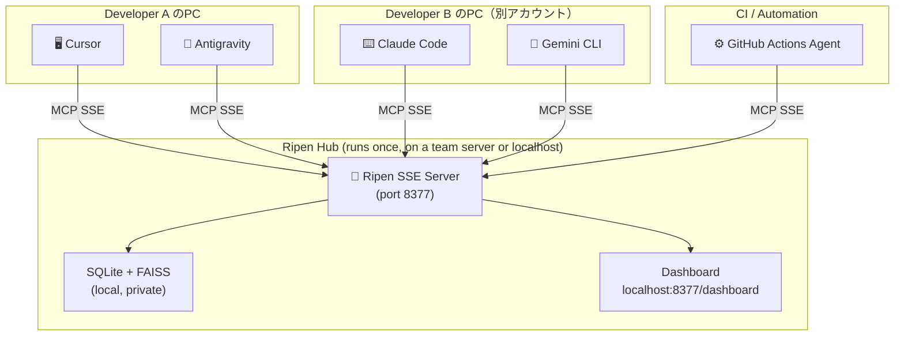

# Ripen: The "Trust Layer" for Multi-Agent AI Teams 🧠

**Centralized Knowledge Hub for AI-Driven Development. Designed for Local and Small-Team workflows.**

[](https://pypi.org/project/ripen/)
[](LICENSE)
[](CHANGELOG.md)
[](https://github.com/ayato-labs/ripen/releases)

> [!IMPORTANT]
> **Official Distribution**: Always download `ripen.exe` from the [Official GitHub Releases](https://github.com/ayato-labs/ripen/releases). This ensures you have the latest signed binary with all security patches.

> [!TIP]
> **🚀 Special Campaign: 1-Year Free Professional License!**
> To celebrate our launch, we are distributing **1-year Professional Licenses for FREE**!
> **Features**: Unlimited sync, commercial rights, and priority updates.
> **How to Apply**: Open a [GitHub Issue](https://github.com/ayato-labs/ripen/issues/new?title=Request+Pro+License) or email [cwblog69@gmail.com](mailto:cwblog69@gmail.com).
> **Activation**: `ripen-admin license activate ./license.rpn`

> 🇯🇵 **Claude Code・Cursor・Antigravity・Gemini CLI——違うアカウントを使った別の人のPCで稼働するAIエージェントとの間でも、知識を共有できる。これが Ripen の根本的な価値です。**

---

## What Makes Ripen Different

Most MCP memory servers run in `stdio` mode — a 1:1 connection between **one IDE and one server**. Knowledge stays siloed inside that single process, invisible to any other tool or person.

**Ripen runs as an SSE Hub** — an HTTP server that accepts **N:1 connections**. Multiple agents, multiple IDEs, multiple teammates on **different machines with different accounts**, all reading and writing to the same shared brain simultaneously.

> **Note on Scale**: Ripen is currently optimized for **local multi-agent usage or small teams (2-3 people)**. It uses SQLite + WAL mode under the hood, which provides excellent local concurrency but is not designed for high-throughput network writes from large distributed teams.

> **Privacy Warning**: Ripen uses background processes (`incremental_distill_knowledge`) to organize memory. **If you configure an external LLM (like Gemini or OpenAI), snippets of your codebase and prompts may be sent to these external APIs.** For strict enterprise environments, we strongly recommend using a local LLM via Ollama.

```
[Typical MCP Memory]                    [Ripen Hub Mode]

Dev A: Cursor   -- memory-A             Dev A: Cursor     ----+
Dev A: Claude   -- memory-B             Dev A: Antigravity ---+
                                        Dev B: Claude Code ---+--> Ripen Hub
Dev B: Cursor   -- memory-C             Dev B: Gemini CLI  ---+
                                        CI Agent -------------+
  No shared knowledge                   Zero manual sync
```

This is the **core innovation**: automated cross-agent, cross-user, cross-machine knowledge sharing via a local SSE server.

---

## Quick Start

### Hub Setup (Run once per project/team)

```bash
# Start the shared knowledge hub
uvx ripen --sse

# In a new terminal: interactive setup wizard
uvx ripen-init
# > Select mode: hub
# Guides you through LLM config, data directory, and IDE registration
# At the end, displays your Client Connection URL for teammates
```

### Client Setup (Every teammate runs this)

```bash
# No Python required. Just register your IDE to the hub.
uvx ripen-init
# > Select mode: client
# > Hub URL: http://192.168.1.10:8377
# Done. All your IDEs now share the team's memory.
```

Or with a single command:
```bash
uvx ripen-register --hub-url http://192.168.1.10:8377
```

---

## The Problem: AI "Multi-Personality Disorder"

AI-driven development made your team 10x faster, but your knowledge is now scattered:

- **Isolated Context**: Cursor knows your coding conventions — but **Claude Code doesn't**.
- **Memory Decay**: Gemini CLI resolved a bug yesterday — but **Cursor forgot it by today**.
- **Architectural Drift**: Your team decided on a pattern — but **every AI tool proposes a different one**.
- **Cross-User Silos**: Developer A's AI made a key decision — but **Developer B's AI has no idea**.

The faster you ship, the faster your AI tools **diverge**. Ripen stops this drift with a **Single Source of Truth (SSoT)** shared by every agent on your team.

---

## Architecture: Hub & Clients



**One Hub. N Clients. Different PCs. Different accounts. Zero manual sync.**

---

## Key Features

### 1. Hybrid Intelligence Store
- **Logic Graph**: Stores entities and relations (e.g., *"AuthModule depends on UserService"*).
- **Memory Bank**: Stores deep context as Markdown (specs, blueprints, post-mortems).
- **Thought Log**: Captures the *reasoning process* behind decisions, not just the output.

### 2. Knowledge Lifecycle (The "Ripening" Process)
- **Maturation**: Frequently accessed knowledge is automatically "ripened" into stable long-term assets.
- **Decay & GC**: Stale or transient noise is automatically archived to keep context high-signal.

### 3. Zero-Config by Design
- LLM not configured? Core search, graph, and Memory Bank still work fully.
- Config priority: `Environment Variable` > `~/.ripen/config.json` > Defaults.
- Hub startup prints a summary of active services and the **Client Connection URL**.

### 4. Professional CLI
| Command | Role |
|---------|------|
| `ripen --sse` | Start the Hub server |
| `ripen-init` | Interactive wizard (Hub or Client mode) |
| `ripen-register --hub-url <url>` | Register any IDE to a remote Hub |
| `ripen-admin` | Knowledge maintenance and GC |

### 5. Observability Dashboard
Visit `http://localhost:8377/dashboard` to see:
- **Active Agents**: Which IDEs/tools are currently connected
- **Knowledge Flow**: Real-time activity timeline
- **Hub Status**: Real-time status of AI Brain (LLM) and Memory Bank (Vector DB)

### 6. Reliability & Health Monitoring (Plan A Strategy)
Ripen prioritizes **system stability** over massive internal dependencies.
- **Proactive Health Checks**: The Hub automatically detects if Ollama or Gemini are available.
- **Zero-Crash Lifespan**: Instead of failing silently or crashing during heavy inference, Ripen provides clear visual warnings in the Dashboard and CLI if a backend is missing.
- **Dependency-Clean**: By leveraging FastEmbed for retrieval and "Bringing Your Own LLM" for reasoning, we ensure the Hub remains lightweight enough to run in the background of any 16GB RAM development machine.

---

## Benchmarks: LongMemEval

| Metric | Local (FastEmbed + Ollama) | Cloud (Gemini 2.0 Flash) |
| :--- | :---: | :---: |
| **Search Latency** | **12ms** | 420ms |
| **Context Recall (RAGAS)** | **0.95** | 0.96 |
| **Independence** | **100% Local** | Cloud Dependency |

---

## Installation

### Option A: Native Binary (Easiest for Windows) 🚀
No Python required. Best for a quick, stable setup.
1. Download `ripen.exe` from [GitHub Releases](https://github.com/ayato-labs/ripen/releases).
2. Run `ripen.exe init` in your terminal to set up your Hub or Client.
3. Use the generated Desktop shortcut to start Ripen anytime.

### Option B: Zero-install (For Python users)
```bash
uvx ripen --sse        # Start Hub
uvx ripen-init         # Setup wizard
```

### Option C: Persistent install
```bash
pip install ripen
ripen-init
```

### Option D: Docker (Team Hub)
```bash
docker run -d -p 8377:8377 -v ripen_data:/data ghcr.io/ayato-labs/ripen
```

---

## 🇯🇵 日本語

### 他のMCPメモリサーバーとの根本的な違い

一般的なMCPメモリサーバーは `stdio` モードで動作し、**1つのIDEと1つのサーバー**が1:1で接続されます。知識はそのIDEのプロセス内に閉じており、他のツールや他のユーザーからは参照できません。

**Ripenは `SSEハブ` として動作します。** HTTPサーバーとして常駐し、複数のIDE・複数のメンバーが同時に読み書きできます。

> **最大のポイント**: Claude Code・Cursor・Antigravity・Gemini CLI の間で知識を共有できます。しかも、**違うアカウントを使った別の人のPCで稼働するAIエージェントとの間でも。**
>
> これは「便利な追加機能」ではなく、エージェントフレームワークが構造的に実現不可能な**唯一の機能**です。

### セットアップ

**親機（Hub）側**: `ripen-init` → `hub` を選択 → 設定完了後に「接続URL」が表示される

**子機（Client）側**: `ripen-init` → `client` を選択 → Hub の URL を入力 → 全IDEに自動登録完了

詳細は [概念的要件定義書](docs/概念的要件定義書.md) · [配信計画](docs/配信計画.md) · [アーキテクチャ](docs/アーキテクチャ.md) をご覧ください。

---

## Data Governance & Privacy 🛡️

Your knowledge is your most valuable asset. Ripen is designed to give you full control over it:

- **Local-First**: All data is stored on your machine in a single SQLite database.
- **Data Location**: By default, everything lives in `~/.ripen/` (Windows: `C:\Users\<User>\.ripen`).
- **Portability**: To backup or migrate, simply copy the `~/.ripen/knowledge.db` file.
- **Complete Erasure**: If you decide to stop using Ripen and want to ensure no data is left behind, run:
  ```bash
  ripen --uninstall
  ```
  This will permanently delete the database, configurations, and shortcuts.

---

## Donations & Support ☕

開発者への寄付やサポートをご検討いただける場合、以下のサービスをご利用いただけます。
日本在住のため Stripe や GitHub Sponsors が利用できないため、**OFUSE (オフセ)** を通じてご支援いただければ幸いです。

👉 **[OFUSE で Ripen を支援する](https://ofuse.me/21cfc1d2)**

---

## License

- **Open Source**: [AGPL-3.0](LICENSE) — free for personal and open-source use.
- **Commercial**: For proprietary team integrations, a [Commercial License](COMMERCIAL.md) is available. 
  - **180-day (6-month) free trial** is standard for all teams.
  - **Special Campaign**: Currently, 1-year Professional Licenses are being distributed for **FREE**. 
  - **Why Free?**: Ripen is open-sourced under AGPL-3.0. We have implemented a strict licensing model specifically to prevent unauthorized "copy-and-sell" practices by third parties while ensuring the community and developers can use it safely and freely.

*Ripen: Making AI agents remember what your team already decided.*
