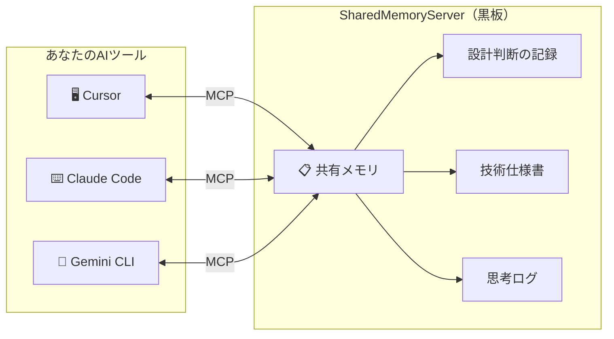

## はじめに：AIが速くなるほど、「知識の断絶」も加速する

AI駆動開発によって、開発速度は圧倒的に上がりました。

しかし、**速くなったことで新しい問題**が生まれています。

> Cursorで「このモジュールは非推奨」と決めた。
> 30分後、ターミナルでGemini CLIを開いたら、そのモジュールを自信満々に使ったコードを提案してきた。

心当たりはありませんか？

これは単なる「AIが馬鹿」という話ではありません。**AI同士が記憶を共有していない**ことが原因です。ツールが増え、アウトプットの速度が上がるほど、この「知識の断絶」は深刻化します。

私はこの現象を**「AIの多重人格障害」**と呼んでいます。そして、これを解決するためのOSSを作りました。

## 1. あなたは「AIの伝書鳩」になっていないか？

複数のAIツールを使い分けるエンジニアの日常を想像してください。

| やりたいこと | 実際に起きること |
|:---|:---|
| 設計ルールを1回決めたい | Cursor、Claude、Geminiの**それぞれに**同じことをコピペしている |
| 昨日の決定を引き継ぎたい | 新しいセッションを開くたびに**ゼロから説明**している |
| チームの暗黙知を共有したい | `.cursorrules` に書いたルールは**他のツールからは見えない** |

結局、人間であるあなたが**「あっちのAIがこう言ってたよ」「こっちのAIにはこれを伝えなきゃ」**と走り回る、AIの伝書鳩（コンテキストのルーター）になっています。

開発速度が10倍になったのに、**情報共有コストも10倍**になっていたら本末転倒です。

## 2. 解決策：すべてのAIが読み書きする「黒板」を置く

この問題を解決するために、**SharedMemoryServer** をオープンソースで作りました。

一言で言えば、**AIのための共有メモ帳**です。あなたのローカル環境（localhost）で動く、中央集権型のナレッジ共有MCPサーバーです。



**MCP（Model Context Protocol）** という業界標準のプロトコルを使って、CursorでもGemini CLIでもClaude Codeでも、同じ1つの「黒板」に接続します。

### どう変わるのか

**Before:**
```
Cursor: 「fastembed使うんですね、了解」
Gemini CLI: 「OpenAI Embeddings APIを使いましょう」  ← 知らない
Claude: 「sentence-transformersがおすすめです」    ← 知らない
```

**After（SharedMemoryServer導入後）:**
```
Cursor: 「fastembed使うんですね。黒板に書いておきます」
Gemini CLI: 「黒板を確認…fastembed採用済みですね。それに沿って実装します」
Claude: 「黒板を確認…fastembed採用済み。レビューもその前提で行います」
```

**一度教えれば、全員が覚える。** これがSharedMemoryServerの本質です。

## 3. なぜ既存ツールではダメなのか

「それ、Mem0やRAGで良くない？」という疑問があると思います。

| | SharedMemoryServer | Mem0 (Cloud) | .cursorrules |
|:---|:---:|:---:|:---:|
| **クロスツール共有** | ✅ MCP経由で全ツール | ❌ API統合が必要 | ❌ Cursor専用 |
| **構造化された知識** | ✅ Graph + Bank | △ ベクター検索のみ | ❌ 平文のみ |
| **プライバシー** | ✅ 完全ローカル | ❌ クラウド送信 | ✅ ローカル |
| **コスト** | ✅ 無料（OSS） | △ 有料プラン | ✅ 無料 |
| **知識の減衰管理** | ✅ 自動アーカイブ | ❌ | ❌ |
| **思考プロセスの記録** | ✅ Sequential Thinking | ❌ | ❌ |

SharedMemoryServerの最大の差別化ポイントは2つです。

### 差別化1: Graph + Bank のハイブリッド記憶

「Module XはService Yに依存する」という**論理構造（Graph）** と、「なぜその設計にしたのか」という**深いコンテキスト（Bank/Markdown）** を同時に管理します。

単純なベクター検索（Naive RAG）では、こうした「論理の繋がり」が失われます。

### 差別化2: 思考の蒸留（Sequential Thinking統合）

AIの推論プロセス自体を記録し、過去の思考を「再利用」できます。

- **Salvage（サルベージ）**: 推論中に「過去に似た判断をしたことがある」と自動で提示
- **Accretion（蓄積）**: セッション終了時に重要な結論を自動でGraphに蒸留

ついに、**使えば使うほどAIが賢くなる**仕組みが完成しました。

## 4. ローカルファーストの衝撃：API待ち時間をゼロにする

今回のアップデートで、**Gemini API への依存を完全に排除**しました。

| 項目 | 旧バージョン (Cloud) | 新バージョン (Local-First) |
|:---|:---:|:---:|
| **検索レイテンシ** | ~420ms | **12ms (約35倍高速)** |
| **Context Recall (RAGAS)** | 0.96 | **0.95 (高精度を維持)** |
| **データ漏洩リスク** | △ クラウド送信あり | ✅ 100% ローカル完結 |

ローカル的 `fastembed` と `Ollama` を組み合わせることで、**「AIが考える前に、記憶がそこにある」** という次元のレスポンス速度を実現しています。

このパフォーマンス評価のために、独自のベンチマーク **LongMemEval** を策定しました。AIエージェントが過去の文脈をどれだけ速く、正確に思い出せるかを定量的に評価しています。

## 5. 3分で試せるQuick Start

```bash
# インストール
uv pip install -e .

# SSEモードで起動（Cursorとターミナルツールの同時接続に推奨）
uv run shared-memory --sse --port 8377
```

起動後、MCPに対応したツール（Cursor、Claude Code、Gemini CLI等）から `http://localhost:8377` に接続するだけです。

APIキーは不要です。ローカルの軽量な埋め込みモデル（fastembed）で動くため、**クラウド依存ゼロ**で即座に使い始められます。

## 5. これからのAI駆動開発に必要なもの

AI駆動開発の速度はこれからも上がり続けます。しかし、**速度が上がるほど「情報共有の設計」が重要になる**という逆説に、まだ多くのチームが気づいていません。

SharedMemoryServerは、この問題に対する最初の体系的な回答です。

- AIツールが入れ替わっても、**設計思想は不変**
- セッションが切れても、**文脈は消えない**
- チームメンバーが増えても、**AIが最初から空気を読める**

「毎回プロンプトに全部書く」時代を終わらせましょう。

---

**GitHub（無料・OSS）:**
https://github.com/ayato-labs/SharedMemoryServer

**ライセンス:** AGPL-3.0（個人・OSS利用は無料）/ 商用ライセンスあり

ぜひ ⭐ Star をいただけると励みになります。Issue / PR も歓迎しています。
