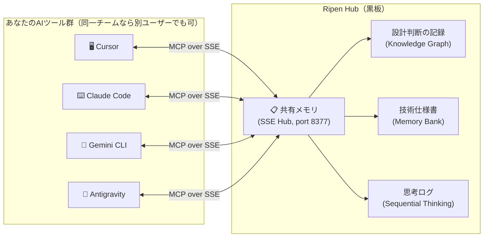

## はじめに：AIが速くなるほど、「知識の断絶」も加速する

AI駆動開発によって、開発速度は圧倒的に上がりました。

しかし、**速くなったことで新しい問題**が生まれています。

> Cursor で「このモジュールは非推奨」と決めた。
> 30分後、ターミナルで Gemini CLI を開いたら、そのモジュールを自信満々に使ったコードを提案してきた。

心当たりはありませんか？

これは単なる「AIが馬鹿」という話ではありません。**AI同士が記憶を共有していない**ことが原因です。そして、これはさらに深刻な形でも現れます。

> 1. **Antigravity** に「認証モジュールの設計方針を決めてもらう」
> 2. **Cursor** に「その方針に沿ってコードを実装してもらう」
> 3. **Claude Code** に「実装したコードのテストを書いてもらう」
> 4. **Gemini CLI** に「リファクタリングを依頼する」

これら4つのAIは、それぞれ独立したコンテキストを持っています。Antigravity が決めた「JWT ではなくセッションベース認証を使う」という設計判断を、Cursor は知りません。結果として、Cursor が JWT で実装し、Claude Code はセッション前提でテストを書き、Gemini が全く別の方針でリファクタリングする――**「AIの多重人格障害」** とでも呼ぶべき混沌が生まれます。

ツールが増え、アウトプットの速度が上がるほど、この「知識の断絶」は深刻化します。

---

## 1. 解決策：すべてのAIが読み書きする「黒板」を置く

この問題を解決するために、**[Ripen](https://github.com/ayato-labs/ripen)** をオープンソースで作りました。

一言で言えば、**AIのための共有メモ帳**です。あなたのローカル環境（localhost）で動く、中央集権型の MCP サーバーです。



MCP（Model Context Protocol）という業界標準のプロトコルを使って、Cursor でも Gemini CLI でも Claude Code でも Antigravity でも、同じ1つの「黒板」に接続します。

### どう変わるのか

**Before:**
```
Cursor:     「fastembed 使うんですね、了解」
Gemini CLI: 「OpenAI Embeddings API を使いましょう」 ← 知らない
Claude:     「sentence-transformers がおすすめです」   ← 知らない
```

**After（Ripen 導入後）:**
```
Cursor:     「fastembed 使うんですね。黒板に書いておきます」
Gemini CLI: 「黒板を確認…fastembed 採用済みですね。それに沿って実装します」
Claude:     「黒板を確認…fastembed 採用済み。レビューもその前提で行います」
```

**一度教えれば、全員が覚える。** これが Ripen の本質です。

---

## 2. 他の MCP メモリサーバーとは何が違うのか

「それ、Mem0 や RAG で良くない？」という疑問があると思います。

| | Ripen | Mem0 (Cloud) | .cursorrules |
|:---|:---:|:---:|:---:|
| **クロスツール共有** | ✅ MCP 経由で全ツール | ❌ API 統合が必要 | ❌ Cursor 専用 |
| **構造化された知識** | ✅ Graph + Bank | △ ベクター検索のみ | ❌ 平文のみ |
| **プライバシー** | ✅ 完全ローカル | ❌ クラウド送信 | ✅ ローカル |
| **コスト** | ✅ 無料（OSS） | △ 有料プラン | ✅ 無料 |
| **知識の減衰管理** | ✅ 自動アーカイブ | ❌ | ❌ |
| **思考プロセスの記録** | ✅ Sequential Thinking | ❌ | ❌ |
| **チーム間・ユーザー間共有** | ✅ SSE Hub で N:1 接続 | ❌ | ❌ |

### 最大の差別化：「エージェントフレームワークに内包できない」唯一の機能

ここが重要です。LangChain や CrewAI などのフレームワークが「うちにもメモリがある」と言っても、それは**そのフレームワーク内でのみ共有できる**にすぎません。

Cursor、Claude Code、Antigravity、Gemini CLI は、**互いに競合する別会社の製品**です。どのフレームワークも、これら全てのランタイムを同時に制御することはできません。

MCP はこれらすべてが採用した唯一の業界標準プロトコルです。Ripen はそのプロトコル層に存在するため、**ツールの壁・会社の壁を超えた知識共有**が技術的に可能な唯一の構造を持っています。

---

## 3. 2種類の記憶構造

単なるテキストのコピペツールではありません。このシステムは以下の2層の記憶を管理しています。

### Memory Bank（静的記憶 / 形式知）
Markdown ファイルとして保存され、AIが現在のモジュールの仕様やコーディングルールを読み込むためのドキュメント。人間が直接編集することもでき、Git で差分管理が可能です。

### Knowledge Graph（動的・関連記憶 / 暗黙知の構造化）
SQLite ベースで構築され、AI 自身が「Entities（エンティティ）」と「Relations（関係性）」を抽出して記録するグラフ型データベース。エージェントが開発を進めるにつれて、自動的に知識ネットワークが成長していきます。

---

## 4. ただの RAG じゃない。「思考（Thought）」の蒸留と自己組織化

このシステムの最大の特徴は、**「AI の思考プロセス自体を記録・蒸留する機能」**を持っていることです。

### Sequential Thinking（逐次思考）の保存
複雑な問題を解く際、AI に各思考ステップ（Thought）を独立したデータベースに記録させます。

### 思考から知識への「自動蒸留（Distillation）」
セッションが終了すると、AI は書き溜めた思考ログを振り返り、**「次回以降も使える汎用的な知識」だけを Knowledge Graph に抽出・保存**します。

つまり、あなたが Antigravity と壁打ちして解決したバグの知見は、Cursor が翌日コードを書くときに**自動的に参照できる「共有資産」**に変換されます。もう二度と「昨日の AI には説明したのに...」と嘆く必要はありません。

---

## 5. ローカルファーストの衝撃：API 待ち時間をゼロにする

| 項目 | クラウド依存 (旧構成) | ローカルファースト (Ripen) |
|:---|:---:|:---:|
| **検索レイテンシ** | ~420ms | **12ms（約35倍高速）** |
| **Context Recall (RAGAS)** | 0.96 | **0.95（高精度を維持）** |
| **データ漏洩リスク** | △ クラウド送信あり | ✅ 100% ローカル完結 |

ローカルの `FastEmbed` と `Ollama` を組み合わせることで、「AI が考える前に、記憶がそこにある」という次元のレスポンス速度を実現しています。

---

## 6. 2種類の導入体験：Hub と Client

Ripen には2つの導入モードがあります。

### 親機（Hub）側 ── チームに1人が実施

```bash
# SSE ハブとして起動（チームで共有するサーバー）
uvx ripen --sse

# 対話型ウィザードで設定 → 最後に「Client 接続 URL」が表示される
uvx ripen-init
# > モードを選択 [hub/client]: hub
```

### 子機（Client）側 ── チームの全メンバーが実施（Python 不要）

```bash
# Hub URL を入力するだけで全 IDE に自動登録
uvx ripen-init
# > モードを選択 [hub/client]: client
# > Hub URL: http://192.168.1.10:8377
# → Cursor / Claude Desktop / VS Code に自動設定完了

# または1コマンドで
uvx ripen-register --hub-url http://192.168.1.10:8377
```

LLM API キーは不要です。`FastEmbed`（ローカル軽量モデル）で動くため、**クラウド依存ゼロ**で即座に使い始められます。

---

## 7. なぜ SaaS ではなく「ローカル MCP」で作ったのか？

- **プライバシーとセキュリティ:** 会社の機密コードのコンテキストを外部 SaaS に送信したくない。データは自分の手元にある。
- **データ主権:** 知識はローカル環境にあり続け、Git で差分管理できる。ベンダーが倒れても知識は失われない。
- **ベンダーロックインの回避:** MCP というオープン標準に乗ることで、Claude Desktop でも Cursor でも Gemini CLI でも、**ツールを問わずに同じ記憶を使い回せる**。
- **ゼロコスト:** 追加の SaaS 契約は不要。SQLite と Markdown という、人類が最も信頼してきた技術スタックのみ。

---

## おわりに：「毎回プロンプトに全部書く」時代を終わらせる

AI 駆動開発の速度はこれからも上がり続けます。しかし、**速度が上がるほど「情報共有の設計」が重要になる**という逆説に、まだ多くのチームが気づいていません。

Ripen は、この問題に対する最初の体系的な回答です。

- AI ツールが入れ替わっても、**設計思想は不変**
- セッションが切れても、**文脈は消えない**
- チームメンバーが増えても、**AI が最初から空気を読める**
- **違うアカウントの別の人の AI でも、同じ知識を共有できる**

---

**GitHub（無料・OSS）:**
https://github.com/ayato-labs/ripen

**ライセンス:** AGPL-3.0（個人・OSS 利用は無料）/ 商用ライセンスあり

ぜひ ⭐ Star をいただけると励みになります。Issue / PR も歓迎しています。
