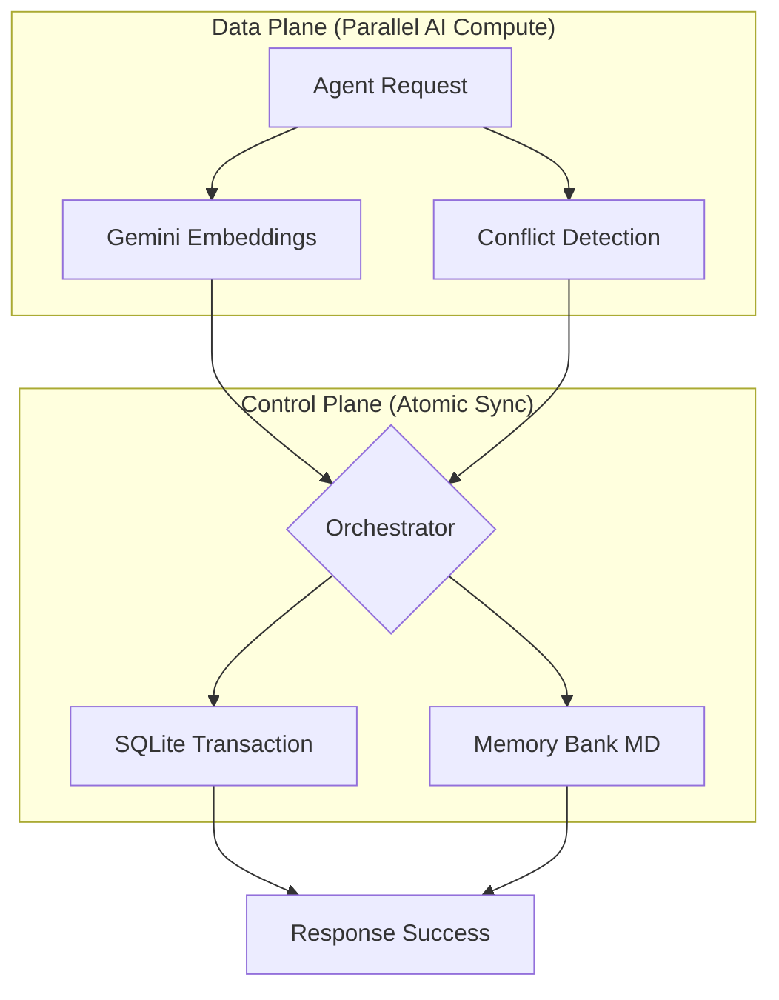

# Architecture: State Governance for Agentic Intelligence

SharedMemoryServer provides a high-integrity infrastructure to govern **Inference-time Latency** and **System Entropy** in complex Agentic Workflows.

## 1. Problem Definition
In advanced AI workflows, the terminal bottleneck is not the *size* of the context window, but its **decay and entropy**. Brute-force approaches (naive RAG) rely on non-deterministic attention. SharedMemoryServer solves this by providing **Reasoning Provenance**—persisting design decisions and logic outside ephemeral session boundaries.

## 2. Design Decisions
### 2-1. Standing on the Shoulders of Giants
We avoid reinventing the wheel. We leverage world-class infrastructure and delegate intelligence to specialized providers:
- **Persistence**: SQLite (`aiosqlite`) for robust, local-first state.
- **Semantic Understanding**: Gemini (`google-genai`) for state-of-the-art embeddings.
- **Interface**: Model Context Protocol (MCP) via `FastMCP` for maximum interoperability.

### 2-2. Compute-then-Write Pattern
To solve SQL lock contention in multi-agent environments, we move expensive AI computations (embeddings) outside database transactions. This reduced lock duration from **~2000ms to <50ms**.

### 2-3. Knowledge Maturity Logic
We implement a unique algorithm to quantify knowledge "ripeness" based on reuse frequency and temporal decay, allowing agents to distinguish between transient noise and established architectural patterns.

## 3. System Architecture

## 4. Constraints and Non-Goals
### 4-1. Rejection of Heuristic Search
We explicitly reject hard-coded ranking logic (e.g., "Priority Boost" for keywords like 'error').
- **Reason**: Modern embedding models already understand context. Manual heuristics create technical debt and hinder the "Free Upgrade" path provided by future model improvements.

### 4-2. No Built-in Reasoning
The server does not "think." It is a specialized "Hippocampus." High-level reasoning is the sole responsibility of the calling Agent.

### 4-3. Infrastructure Transparency
We do not build a proprietary UI. The infrastructure should be invisible, surfaced only through the tools utilized by the Agent.

---
*For more details, see [Usage Guide](usage.md) and [Operations Manual](operations.md).*
