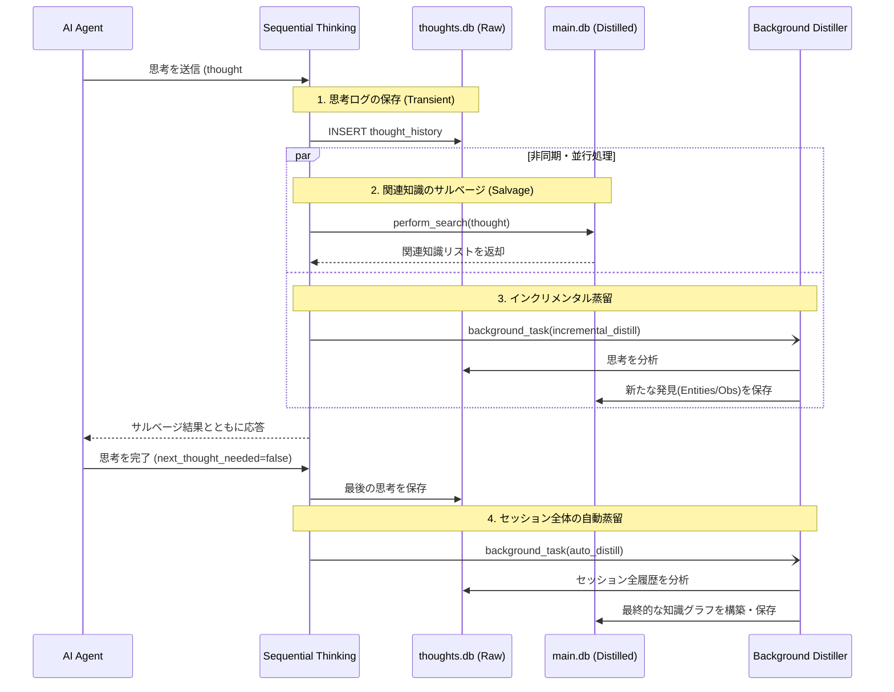

# Sequential Thinkingを取り巻く一連のフローと詳細アルゴリズム

このドキュメントでは、Ripen MCPのコア機能である `sequential_thinking` がどのように機能し、AIの思考プロセスがどのように永続的な「知識（Knowledge）」へと昇華（Ripen）されるのか、その全体像と背後で動くアルゴリズムを解説します。

## 1. 全体像（The Big Picture）

Ripenの最大の特徴は、AIがただツールを呼び出すだけで、**「バックグラウンドで勝手に知識が抽出・整理される」**という魔法のようなUXにあります。

この仕組みは、大きく分けて2つのデータベースと、3つの非同期プロセスによって支えられています。

### データの二重管理（Dual Storage）
1. **`thoughts.db` (Transient / 作業記憶)**: 
   - 役割: AIの試行錯誤、生ログ、途中経過をすべて記録するバッファ。
   - 特徴: 肥大化しやすく、ノイズが多い。
2. **`main.db` (Stable / 長期記憶)**: 
   - 役割: 抽出・検証された事実（Entities, Observations, Bank Files, Troubleshooting）を保存する金庫。
   - 特徴: 高品質で、全エージェントが従うべき「真実の源泉（SSoT）」。

---

## 2. 処理フロー（Sequence Diagram）

以下の図は、AIエージェントが `sequential_thinking` を呼び出した際に、裏側で何が起きているかを示しています。

---

## 3. 各プロセスの詳細アルゴリズム

### ① 思考の永続化 (Persistence)
- **ソース**: `src/ripen/core/thought_logic.py` (`process_thought_core`)
- **アルゴリズム**:
  - 受信した `thought` から機密情報（APIキーなど）をマスク処理。
  - 重複チェック（同一セッション・同一思考番号の防止）を実施。
  - `thoughts.db` の `thought_history` テーブルに INSERT。

### ② 自動サルベージ (Salvage)
- **ソース**: `src/ripen/cli/salvage.py` (`salvage_related_knowledge`)
- **アルゴリズム**:
  - 受信した `thought` の内容をクエリとして、`perform_search`（ハイブリッド検索）を実行。
  - ベクトル検索（意味的類似度）とBM25（キーワード一致）を組み合わせ、関連する過去の知識をスコアリングして上位候補を取得。
  - **【重要アップデート予定】**: AIが過去の「誤った試行錯誤」に引っ張られる（ハルシネーション）のを防ぐため、検索対象を `main.db`（抽出済みの確定知識）のみに限定し、`thoughts.db`（生の思考ログ）を検索対象から**完全除外**する。

### ③ インクリメンタル蒸留 (Incremental Distillation)
- **ソース**: `src/ripen/core/distiller.py` (`incremental_distill_knowledge`)
- **アルゴリズム**:
  - **非同期**でバックグラウンド実行される。メインの思考ループ（レスポンス速度）をブロックしない。
  - 単一の `thought` を裏側のLLM（Ollama/Gemini）に渡し、「この思考の中に、保存すべき新しい事実やエンティティが含まれているか？」をJSONスキーマで抽出させる。
  - 新しい発見があれば、自動的に `save_memory` ロジックを叩き、`main.db`（長期記憶）へ昇格させる。

### ④ セッション最終蒸留 (Auto Distillation)
- **ソース**: `src/ripen/core/distiller.py` (`auto_distill_knowledge`)
- **アルゴリズム**:
  - AIが `next_thought_needed: false` を送信したタイミングでトリガー。
  - セッション全体の文脈（すべての思考履歴）をLLMに渡し、プロセス全体を通じた最終的な「知識グラフ（Entities/Relations/Observations）」を構築・保存する。
  - これにより、プロセス途中の勘違いや軌道修正が整理され、最終的な「正解」だけが長期記憶に残る。

---

## 4. なぜこのアーキテクチャが優れているのか？（UXの魔法）

ユーザー（AIエージェント）から見れば、単に `sequential_thinking` を使って「声に出して考えている」だけです。特別な保存コマンド（`save_memory`）を叩かなくても、**Ripenが裏側で「思考のゴミ」から「砂金（事実）」を自動的に拾い集め、整理された長期記憶の金庫（`main.db`）に入れてくれます。**

そして、次回以降の思考プロセス（自動サルベージ）では、その整理された「砂金」だけがプロンプトに注入されるため、使えば使うほどAIは前回の学習を踏まえて賢く立ち振る舞うようになります。

### 【今後の改修：知識の明確な分離】
現状、自動サルベージ時に「金庫（main.db）」だけでなく「ゴミ箱（thoughts.db）」まで一緒に検索してしまっているため、情報のノイズが発生しています。今後の改修でこれらを完全に分離（Isolation）することで、**「ノイズのない洗練された記憶だけがフィードバックされる」**という、真に堅牢なナレッジシステムが完成します。
