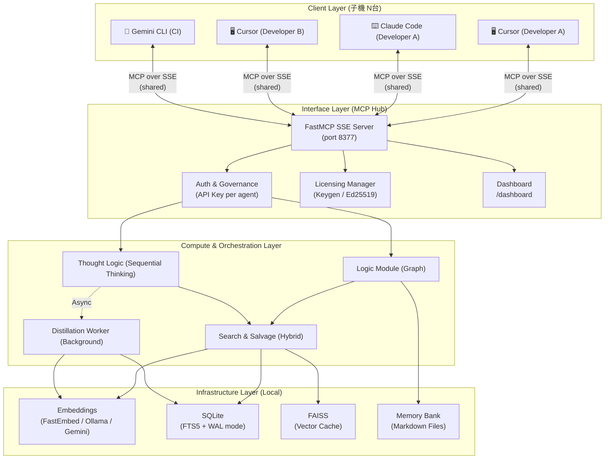
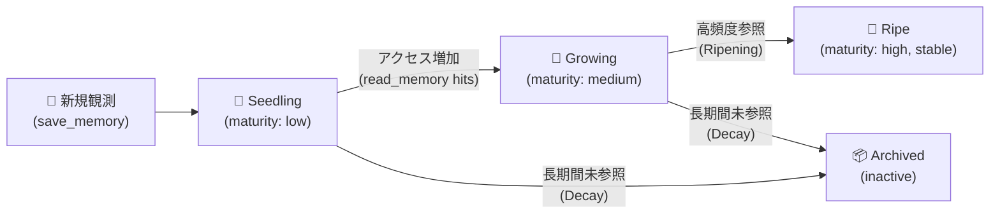

# Ripen アーキテクチャ詳細

本ドキュメントは、Ripenの内部構造、データフロー、および主要な設計パターンについて詳細に解説します。

---

## 1. システム全体構成 (High-Level Architecture)

Ripenは **Hub & Client モデル** を採用しています。親機（Hub）がSSEサーバーとして常駐し、複数の子機（IDE/エージェント）が同時接続することで、チーム規模のリアルタイム知識共有を実現します。

### 1-1. 接続モードの比較

| | stdio モード | SSE ハブモード |
|---|---|---|
| **接続数** | 1:1（IDE ↔ Server） | N:1（複数IDE/ユーザー ↔ Server） |
| **知識の共有** | 不可（プロセス境界で分断） | **可能（全クライアントが同一DBを参照）** |
| **起動方法** | `ripen`（デフォルト） | `ripen --sse` |
| **対象** | 個人の単独使用 | チーム開発・複数エージェント |

---

## 2. Hub & Client セットアップモデル

### 親機（Hub）の役割
- SQLite + FAISS でデータを永続管理する唯一の権威（Authority）
- SSEエンドポイント（`http://<IP>:8377/sse`）を公開
- Dashboard（`/dashboard`）で接続エージェントと知識フローを可視化
- `ripen-init hub` で設定・起動する

### 子機（Client）の役割
- Python のインストール不要
- Hub の URL を知っているだけで接続可能
- IDE の MCP 設定に `mcp-remote <hub-url>/sse` を追加するだけ
- `ripen-init client` または `ripen-register --hub-url <url>` で自動登録

---

## 3. コア設計パターン (Core Design Patterns)

### 3-1. Compute-then-Write パターン
マルチエージェント環境におけるSQLiteのロック競合を防ぐための最重要パターンです。
- **課題**: 埋め込みベクトルの計算はDBトランザクション内で実行すると、他エージェントの読み書きを数秒間ブロックします。
- **解決策**: AI計算（Embedding、LLM蒸留）はトランザクションの外で完了させ、DB書き込み自体は **< 50ms** でアトミックに実行します。

### 3-2. ハイブリッド検索 (FTS5 + Vector Similarity)
検索精度と速度を両立させる2段構えの検索を実装しています。
1. **FTS5 (Full-Text Search)**: N-gramトークナイザーによるキーワードの完全一致検索。IDや関数名の特定に威力を発揮します。
2. **Semantic Search (Vector)**: 意味的な類似度による検索。`FastEmbed`（ローカル）または `Google Gemini`（クラウド）でベクトル化します。
3. **ハイブリッドランキング**: 両スコアを統合し、最終的な結果リストを生成します。

### 3-3. Sequential Thinking の厳格なID管理 (Reasoning Provenance)
エージェントの思考プロセスを記録し、論理の一貫性を保つための基盤です。
- **重複検知と遮断**: `thought_history` テーブルの `(session_id, thought_number)` に `UNIQUE` 制約を適用。
- **Revision と Branching**: 明示的な `is_revision=True` フラグや `branch_id` を要求することで、「なぜ思考が変更されたか」という由来（Provenance）を保証します。

### 3-4. ゼロコンフィグ起動とGraceful Degradation
LLMが未設定でも基本機能は完全に動作します。
- **LLM未設定時**: 知識蒸留は無効になるが、FTS5検索・Vector検索・グラフ操作・Memory Bankは稼働。
- **設定優先順位**: 環境変数 > `~/.ripen/config.json` > デフォルト値。

---

## 4. 知識のライフサイクルと成熟度 (Knowledge Maturity)

### 4-1. パラメータの定義
- **Stability (安定性)**: 情報内容が変化しない度合い。コンフリクト頻度が高いと低下。
- **Importance Score (重要度)**: Salvage（検索ヒット）と Accretion（エージェントによる活用）の回数に応じて増加。
- **Decay Rate (減衰率)**: 最終アクセスからの時間経過に伴い重要度を低下させる係数。

### 4-2. 蒸留 (Distillation) と GC (Garbage Collection)
- **Incremental Distillation**: 思考ステップのたびにバックグラウンドで一時コンテキストから Entity/Relation を抽出。
- **Final Distillation**: セッション終了時に履歴全体を俯瞰し、高シグナルな知識を Graph/Bank に定着。
- **Garbage Collection**: 閾値を下回ったノイズはバックグラウンドで自動的に Archive 状態へ移行。

---

## 5. プロトコルの安定化パッチ (Protocol Resilience)

MCPプロトコルの制約や特定クライアントの挙動に起因する切断を防ぐ深層パッチを適用しています。

- **Permissive Handshake**: `InitializeRequest` が遅延・欠落した場合でも、タイムアウト後に強制的に `Initialized` 状態へ移行するモンキーパッチ。
- **Type Sanitization**: エージェントが誤った型（文字列 vs 整数）を送信した場合に再帰的に型変換してバリデーションエラーを吸収する `_sanitize_mcp_dict` 関数。
- **Extreme Guard (STDOUT Redirect)**: `stdio` モード使用時、`print` による標準出力がJSON-RPCプロトコルを破壊しないよう `sys.stdout = sys.stderr` でリダイレクト。

---

## 6. データベーススキーマの概要

物理ファイルは役割ごとに分割されています。

| ファイル | 役割 | 特徴 |
|---------|------|------|
| `knowledge.db` | コア記憶（Graph, Bank, Observations） | WALモード、マルチアクセス最適化 |
| `thoughts.db` | Sequential Thinking 履歴 | 大容量・一時的データのため分離 |
| `master.db` | システムステータス、マイグレーション履歴 | 単一ライター想定 |

---

## 7. ライセンス管理コンポーネント (Licensing Infrastructure)

商用環境での信頼性を担保するため、Ripenは暗号学的に保護されたライセンス認証システムを備えています。

### 7-1. コンポーネントの責務
- **`LicenseManager`**: キーの有効化（Activation）、ローカルキャッシュ、および署名検証を担当。
- **Keygen.sh 連携**: クラウド側の権威として、ライセンス発行とデバイス制限を管理。

### 7-2. 検証フロー (Offline-First Validation)
1. **Startup**: サーバー起動時、`LicenseManager` が `~/.ripen/license.cache` を読み込む。
2. **Signature Check**: 保存された `Keygen-Signature` を抽出し、ハードコードされた **Ed25519 公開鍵** を用いて、レスポンス内容が改ざんされていないか数学的に検証。
3. **Guard**: 検証に失敗、または期限切れの場合、サーバーは「FREE/TRIAL」モードで動作し、商用限定機能の読み込みを制限する。
4. **Offline Resilience**: 一度アクティベートされれば、署名の有効期間内（デフォルト: 180日以上）はインターネット接続なしで起動・動作を保証。

*詳細な実装仕様は `licensing/implementation.md` を参照してください。*
