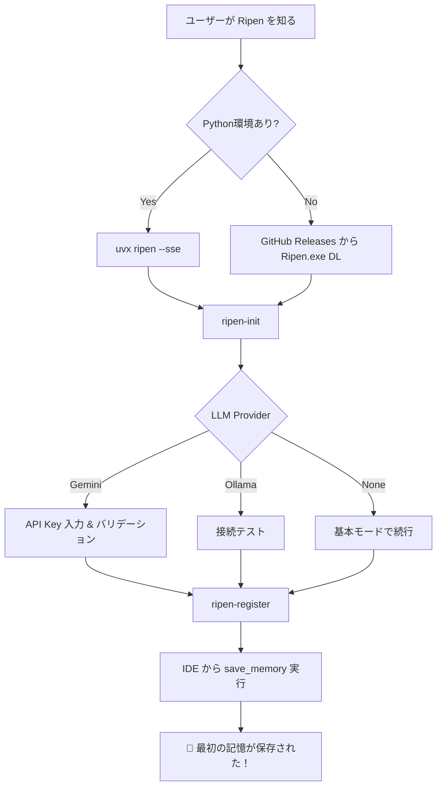

# Ripen 配信計画 (Distribution Plan)

## 1. 配信チャネルと優先順位

| 優先度 | チャネル | ターゲット | コマンド | 状態 |
|:---:|---------|-----------|---------|:----:|
| 🥇 | **PyPI** (`uvx`) | 全ユーザー（最速の導入体験） | `uvx ripen` | ✅ v0.1.0 公開済 |
| 🥈 | **PyPI** (`pip`) | 永続インストール希望者 | `pip install ripen` | ✅ 同上 |
| 🥉 | **ネイティブバイナリ** | Python 環境を持たないユーザー | `Ripen.exe` (PyInstaller) | 🔧 CI/CD 修正中 |
| 4 | **Docker** | チームハブ運用 / サーバー常駐 | `docker run ripen` | 🔧 Dockerfile 修正中 |
| 5 | **GitHub Releases** | バイナリの手動ダウンロード | GitHub Actions で自動添付 | 🔧 パス修正中 |

---

## 2. ユーザー体験の設計（Time to First Memory）

### 2-1. 目標: 3分以内に最初の `save_memory` が成功する

```
[Before]  git clone → uv install → .env作成 → auth.json作成 → サーバー起動 → IDE設定
          ~~~~~~~~~~~~~~~~~~~~~~~~~~~~~~~~~~~~~~~~~~~~~~~~~~~~~~~~~~~~~~~~~~~~~~~~
          所要時間: 15〜30分（エラーで挫折するリスク大）

[After]   uvx ripen            ← 1コマンドでサーバー起動
          ripen-init           ← 対話型ウィザードで設定完了
          ripen-register       ← IDE に自動登録
          ~~~~~~~~~~~~~~~~~~~~~~~~
          所要時間: 2〜3分
```

### 2-2. 導入フロー（ユーザーの行動ステップ）



---

## 3. フェーズ別リリース計画

### Phase 1: PyPI 配布基盤 ✅ 完了
- [x] プロジェクト名を `ripen` にリブランディング
- [x] `pyproject.toml` に `hatchling` ビルドシステムを導入
- [x] CLI エントリポイント（`ripen`, `ripen-init`, `ripen-register`, `ripen-admin`）を登録
- [x] PyPI に v0.1.0 を公開（名前の確保）
- [x] `uv build` → `uv publish` パイプラインの確立

### Phase 2: 対話型セットアップウィザード 🔧 実装中
- [x] `ripen-init` コマンドの実装（LLM選択、API Key、IDE登録）
- [x] `~/.ripen/config.json` による設定永続化
- [x] `config.py` の設定優先順位: 環境変数 > config.json > デフォルト
- [ ] Gemini API Key のリアルタイムバリデーション
- [ ] `--non-interactive` モード（CI/CD対応）

### Phase 3: IDE 自動登録の強化 🔧 実装中
- [x] `ripen-register` のクロスプラットフォーム対応（Windows/macOS/Linux）
- [x] `uvx ripen` ベースの MCP 設定生成
- [ ] VS Code / Windsurf の設定ファイル対応追加
- [ ] SSE モード（`mcp-remote` 経由）の自動登録

### Phase 4: ランタイム堅牢化（未着手）
- [ ] Dockerfile の ENTRYPOINT 修正
- [ ] サーバー起動時のステータスサマリ表示
- [ ] ヘルスチェックエンドポイント (`/health`)
- [ ] Graceful Degradation の明示化（LLM未設定時の挙動説明）

### Phase 5: ドキュメント・CI/CD 刷新（未着手）
- [ ] README.md を「3行で動く」Quick Start に刷新
- [ ] GitHub Actions の PyInstaller パス修正
- [ ] PyPI 自動公開ステップを CI/CD に追加
- [ ] `awesome-mcp-servers` への登録申請

---

## 4. PyPI リリース戦略

| バージョン | マイルストン | リリース条件 |
|-----------|------------|-------------|
| `0.1.0` | 名前の確保 | ✅ 公開済 |
| `0.2.0` | Phase 2 + 3 完了 | `ripen-init` と `ripen-register` が安定動作 |
| `0.3.0` | Phase 4 完了 | Docker / ヘルスチェック / Graceful Degradation |
| `1.0.0` | 正式リリース | 全 Phase 完了。README 刷新。`awesome-mcp-servers` 掲載 |

### バージョニング方針
- **Semantic Versioning** に準拠
- `develop` ブランチでの開発 → `main` へのマージで GitHub Actions がタグ付け → PyPI 自動公開

---

## 5. 競合優位性

| 観点 | 他の MCP Memory Server | Ripen |
|------|----------------------|-------|
| 導入コスト | git clone + 手動設定 | `uvx ripen` 1コマンド |
| 設定の容易さ | .env を手書き | `ripen-init` 対話型ウィザード |
| IDE 連携 | JSON を手書き | `ripen-register` 自動検出・登録 |
| LLM 依存 | 必須（動かない） | オプション（なくても基本機能は動作） |
| 検索方式 | ベクトルのみ | ベクトル + FTS5 + グラフ のハイブリッド |
| 知識管理 | 蓄積のみ | 熟成（Ripening）+ 自動アーカイブ |

---

## 6. マーケティング連携

### 公開時のアナウンス計画
1. **Zenn 記事**: 「AI エージェントに記憶を与える — `uvx ripen` で始める長期記憶インフラ」
2. **GitHub README**: 3行 Quick Start + デモ GIF
3. **awesome-mcp-servers**: PR 提出
4. **X (Twitter)**: デモ動画付きツイート
5. **Hacker News**: Show HN 投稿（英語）

### キーメッセージ
> **"Your AI forgets everything. Ripen remembers."**
> 
> 5文字のコマンドで、AIエージェントに長期記憶を与える。
> 知識は時間とともに「熟成」し、ノイズは自動的に淘汰される。
