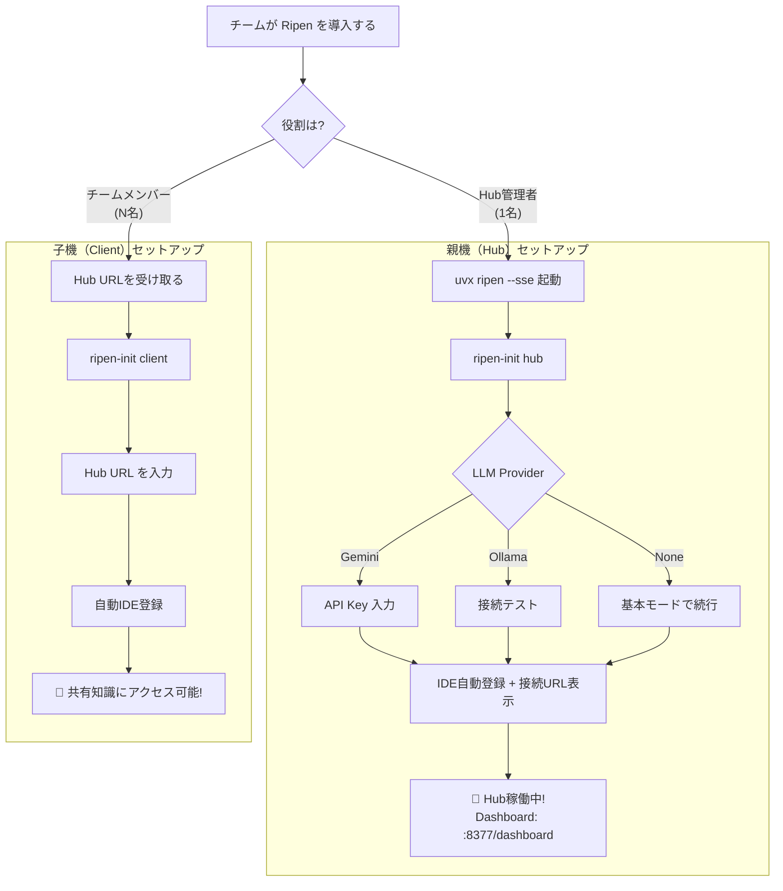

# Ripen 配信計画 (Distribution Plan)

## 1. 配信チャネルと優先順位

| 優先度 | チャネル | ターゲット | コマンド | 状態 |
|:---:|---------|-----------|---------|:----:|
| 🥇 | **ネイティブバイナリ** | Python 環境を持たないユーザー | `Ripen.exe` (PyInstaller) | ✅ 完成 |
| 🥈 | **GitHub Releases** | バイナリの手動ダウンロード | GitHub Actions で自動添付 | ✅ 構築済 |
| 🥉 | **PyPI** (`uvx`) | 全ユーザー（最速の導入体験） | `uvx ripen --sse` | ✅ 公開済 |
| 4 | **PyPI** (`pip`) | 永続インストール希望者 | `pip install ripen` | ✅ 同上 |
| 5 | **Docker** | チームハブ運用 / サーバー常駐 | `docker run ghcr.io/ayato-labs/ripen` | ✅ 整備済 |
| 6 | **Enterprise Add-on** | 有料ユーザー（独自機能） | 専用ダウンロードURL | ✅ 実装済 |

---

## 2. ユーザー体験の設計（Hub/Client モデル）

### 2-1. 2種類の導入体験

```
【親機（Hub）の導入】 — チームに1人が実施
  uvx ripen --sse          ← SSEサーバー起動（ゼロコンフィグ）
  ripen-init               ← "hub" を選択してウィザード設定
  → 完了後に「Client Connection URL」を表示
  所要時間: 3〜5分

【子機（Client）の導入】 — チームの全メンバーが実施
  ripen-init               ← "client" を選択してURLを入力
  or
  ripen-register --hub-url http://192.168.1.10:8377
  → 自動でCursor/Claude Desktop等に登録完了
  所要時間: 30秒〜1分（Pythonすら不要）
```

### 2-2. 導入フロー（ユーザーの行動ステップ）



---

## 3. フェーズ別リリース計画

### Phase 1: PyPI 配布基盤 ✅ 完了
- [x] プロジェクト名を `ripen` にリブランディング
- [x] `pyproject.toml` に `hatchling` ビルドシステムを導入
- [x] CLI エントリポイント（`ripen`, `ripen-init`, `ripen-register`, `ripen-admin`）を登録
- [x] PyPI に v0.1.0 を公開（名前の確保）
- [x] `uv build` → `uv publish` パイプラインの確立
- [x] GitHub リポジトリを `SharedMemoryServer` → `ripen` にリネーム

### Phase 2: Hub/Client モデルの実装 ✅ 完了
- [x] `ripen-init` を Hub/Client の2モードに分離
- [x] `ripen-init hub`: LLM選択、API Key、IDE登録 + 接続URL表示
- [x] `ripen-init client`: Hub URL 入力のみで全IDE登録
- [x] `ripen-register --hub-url <url>`: リモートHub登録のCLIコマンド
- [x] `~/.ripen/config.json` による設定永続化
- [x] `config.py` の設定優先順位: 環境変数 > config.json > デフォルト
- [x] デフォルトtransportを `sse` に変更（共有前提）

### Phase 3: IDE 自動登録の強化 🔧 実装中
- [x] `ripen-register` のクロスプラットフォーム対応（Windows/macOS/Linux）
- [x] `mcp-remote` 経由でリモートHub接続設定を自動生成
- [ ] VS Code / Windsurf の設定ファイル対応追加
- [ ] Gemini API Key のリアルタイムバリデーション
- [ ] `--non-interactive` モード（CI/CD対応）

### Phase 4: ランタイム堅牢化 🔧 対応中
- [x] Dockerfile を `ripen` コマンド + VOLUME `/data` 構成に更新
- [x] ダッシュボードを「Active Agents」可視化付きに刷新
- [x] README を Hub/Client モデル中心に書き換え
- [ ] ヘルスチェックエンドポイント (`/health`)
- [ ] Hub起動時にClient接続URLをコンソール表示する機能の強化
- [ ] docker-compose.yml の提供（チームハブ用テンプレート）

### Phase 5: ドキュメント・CI/CD 刷新 ✅ 完了
- [x] `docs/アーキテクチャ.md` をHub/Clientモデル中心に書き換え
- [x] `docs/概念的要件定義書.md` に §2-15（Hub/Clientモデル）を追加
- [x] `docs/配信計画.md` をHub/Clientモデル対応に更新
- [x] GitHub Actions による PyInstaller ビルドパイプラインの確立
- [x] PyPI 自動公開ステップを CI/CD に追加
- [ ] awesome-mcp-servers への登録申請

### Phase 6: 有料版デリバリー基盤 ✅ 完了 (Gumroad先行)
- [x] 分離リポジトリ (`ripen-enterprise`) のボイラープレート作成
- [x] Gumroad による決済・ライセンス発行フローの確定
- [x] CLI への `--activate` および `--license-status` コマンドの追加
- [ ] Gumroad ライセンス検証 API の統合
- [ ] `ripen-cloud` アドオンパッケージの実装

---

## 4. PyPI リリース戦略

| バージョン | マイルストン | リリース条件 |
|-----------|------------|-------------|
| `0.1.0` | 名前の確保 | ✅ 公開済 |
| `0.2.0` | Hub/Client モデル完成 | `ripen-init hub/client` が安定動作。Dashboard でActive Agents表示 |
| `0.3.0` | インフラ完成 | Docker / ヘルスチェック / docker-compose.yml |
| `1.0.0` | 正式リリース | 全 Phase 完了。README 刷新。`awesome-mcp-servers` 掲載 |

### バージョニング方針
- **Semantic Versioning** に準拠
- `develop` ブランチでの開発 → `main` へのマージで GitHub Actions がタグ付け → PyPI 自動公開

---

## 5. 競合優位性

| 観点 | 他の MCP Memory Server | Ripen |
|------|----------------------|-------|
| 導入コスト | git clone + 手動設定 | `uvx ripen --sse` 1コマンド |
| 設定の容易さ | .env を手書き | `ripen-init` 対話型ウィザード（Hub/Clientモード） |
| **チーム共有** | **不可能（stdio = 1:1接続）** | **可能（SSE Hub = N:1接続）** |
| 子機の導入コスト | — | URL入力のみ、Python不要、30秒 |
| IDE 連携 | JSON を手書き | `ripen-register` 自動検出・登録 |
| LLM 依存 | 必須（動かない） | オプション（なくても基本機能は動作） |
| 検索方式 | ベクトルのみ | ベクトル + FTS5 + グラフ のハイブリッド |
| 知識管理 | 蓄積のみ | 熟成（Ripening）+ 自動アーカイブ |
| 可観測性 | なし | Dashboard（Active Agents / Knowledge Flow） |

---

## 6. マーケティング連携

### 核心メッセージの更新

> **"Every MCP memory server is 1:1. Ripen is N:1."**
>
> 他のメモリサーバーは stdio で動き、1つのIDEにしか繋がらない。Ripenは SSEハブとして動き、チームの全AIが同じ知識を共有する。

### 公開時のアナウンス計画
1. **Zenn 記事**: 「`uvx ripen --sse` で始める — チームのAIに共有記憶を持たせる方法」
2. **GitHub README**: Hub/Client の30秒デモ GIF
3. **awesome-mcp-servers**: PR 提出（SSE Hubとして差別化）
4. **X (Twitter)**: 「2つのIDEで同じ知識を参照するデモ動画」
5. **Hacker News**: Show HN「We built a shared memory hub for AI agents — not just a per-IDE store」

---

## 7. ライセンスと収益化の哲学

### 基本方針：「便利に使ってもらえるなら、自分に負担がない限り無料でいい」

Ripen は個人開発者のプロジェクトであり、大規模なインフラ維持費やフルタイム人件費はかかっていない。
そのため、ライセンス戦略は「利益の最大化」ではなく、**「搾取の防止」と「善意の利用者への開放」** を両立することを最優先とする。

### 守りたいこと（絶対に許さないこと）
- Ripen のコードを丸ごとコピーし、自分の製品として再販・SaaS化して利益を得る行為。
- 開発者（ayato-labs）の貢献を無視し、第三者が「自分が作った」と偽って配布する行為。

### 許容すること（むしろ歓迎すること）
- 個人・チーム・企業が、自社の開発ワークフロー改善のために Ripen を自由に使うこと。
- Ripen を改良し、その改良をコミュニティに還元してくれること（AGPL の精神）。

### 商用ライセンスの考え方
Ripenの持続的な開発と、増大する管理・サポート責任に対応するため、以下のライセンス体系を標準として運用します。

- **Professional License**: 商用利用およびチーム利用向けの標準プラン。
  - **180日間無料試用**: 導入障壁を最小化するため、半年間の長期試用期間を提供。
  - **継続利用料金**: 月額 1,000 円 / 年額 10,000 円（2ヶ月分お得）。
  - **価値**: 収益はインフラ維持費のほか、セキュリティアップデートの提供、および新機能開発の原動力として活用されます。
- **Personal/OSS/Non-Profit**: 個人利用、教育目的、およびOSSプロジェクトでの利用は、**永続的に無料（AGPL-3.0）** です。
- **Enterprise Plan**: 大規模組織やSSO連携、特別なSLAが必要な場合は、個別見積もりにて対応します。

### なぜ AGPL-3.0 なのか
- 「勝手にビジネスされるのが癪」という感情は正当である。自分の時間を投じて作ったものが、他人の利益のためだけに搾取されるべきではない。
- AGPL-3.0 は、ネットワーク越しの利用（SaaS化）にもソース公開義務を課す、最も強力なコピーレフトライセンスである。これにより、「Ripen を使ったサービスを売りたいなら、ソースを公開するか、商用ライセンスを買え」という交渉の土台が作れる。
- 普及しなかったとしても、ポートフォリオとしての価値は残る。その意味でも、知財を安売りする必要はない。

### 将来の見直し条件
- 利用者数やコミュニティの規模が拡大し、「標準化」が普及よりも重要になった場合、MPL 2.0 や Apache 2.0 への移行を再検討する。
- ただし、移行は **開発者（ayato-labs）の明示的な意思決定** によってのみ行われる。

---

## 8. 商用ロジックの配置と管理

知的財産（IP）の保護と、商用機能の完全性を担保するため、商用ロジックは以下の通り厳格に分離・配置されます。

### 8-1. 物理的なリポジトリの分離
商用版の全ロジックは、公開リポジトリ (`ripen`) から完全に独立した **プライベートリポジトリ (`ripen-enterprise`)** で管理されます。

### 8-2. 主要ロジックの配置場所
| 機能 | 配置ファイル (ripen-enterprise 内) | 説明 |
|------|-----------------------------------|------|
| **ライセンス検証** | `src/ripen_enterprise/licensing.py` | Keygen.sh API との通信、署名検証、デバイスIDチェックを担当。 |
| **統合プラグイン** | `src/ripen_enterprise/plugin.py` | `ripen-core` の DI（依存性注入）コンテキストに商用機能を注入するエントリーポイント。 |
| **商用限定機能** | `src/ripen_enterprise/features/` | クラウド同期、高度な分析ツール、SSO連携など。 |

### 8-3. ガバナンス方針
- 公開版 (`ripen`) のコードベースには、商用キーや秘密URLを一切ハードコードしない。
- 商用機能の有効化は、実行環境における `ripen-enterprise` パッケージの検出にのみ依存させる。
- すべての商用ロジックのコミットは、CLA（貢献者ライセンス合意）が適用されたクリーンな環境で行う。
